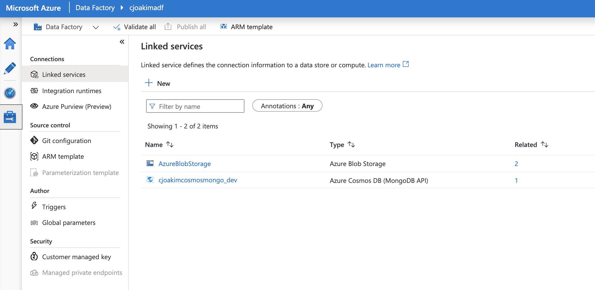
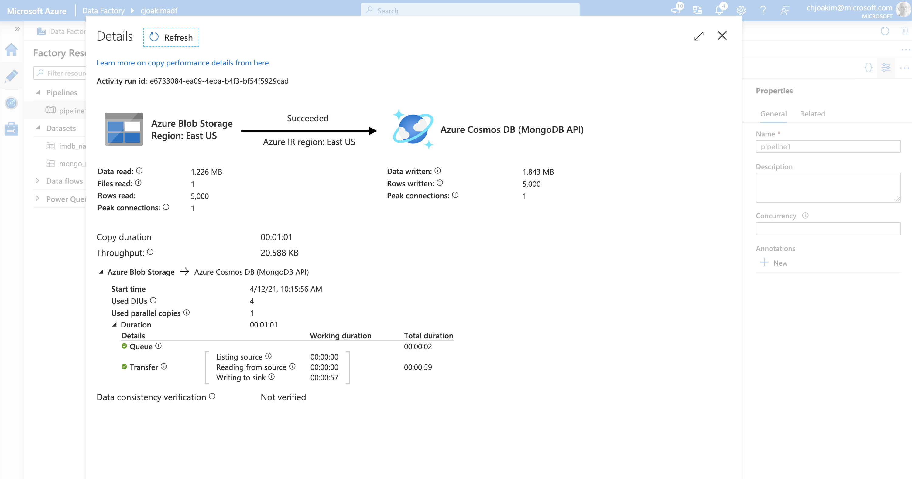
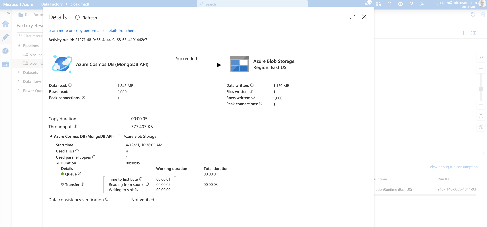

# Azure Data Factory (ADF) and CosmosDB

CosmosDB easily integrates with Azure Data Factory.

## Load and Backup Example

### Provision Azure PaaS Services

- Create an Azure CosmosDB account; Mongo API in this example
- Create an Azure Data Factory account
- Create an Azure Storage account

### Populate Azure Storage with Input File

Storage container **mongo**, file **name_basics_small_source_5k.json**

This is a **mongoexport** file with 5000 documents

### Azure Data Factory - Copy from Blob to CosmosDB

- In ADF, define the **LinkedServices** - the Storage and CosmosDB accounts, see image below
- In ADF, define the **Datasets** - Storage Blob, and CosmosDB target container
- In ADF, define the **CopyData Pipeline** - from source (blob) to sink (container) datasets
- In ADF, exeute the **CopyData Pipeline** - results shown below

-

### Azure Data Factory - Copy from Blob to CosmosDB

- In ADF, the **LinkedServices** - the Storage and CosmosDB accounts, were already created above
- In ADF, define backup blob **Dataset** - mongo-backups Storage container
- In ADF, define the **CopyData Pipeline** - from source (container) to sink (blob) datasets
- In ADF, exeute the **CopyData Pipeline** - results shown below

