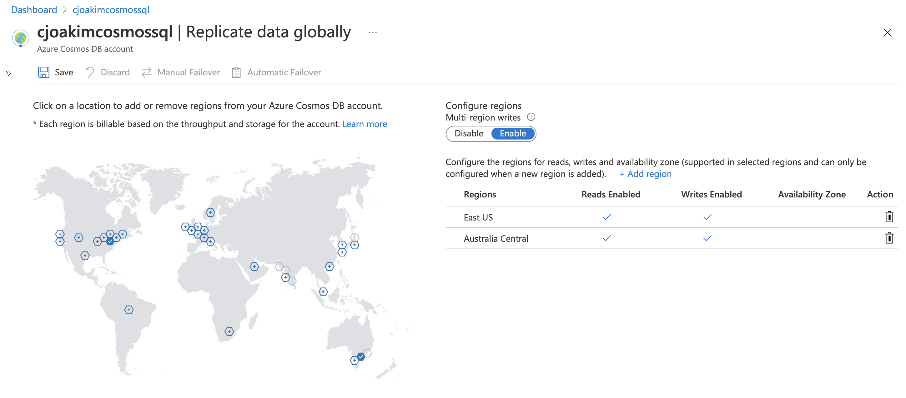

# Azure CosmosDB Node.js Multi-Region Example

<p align="center"></p>

## npm libraries

```
npm install @azure/cosmos
npm install string-format
```

- https://www.npmjs.com/package/@azure/cosmos
- https://docs.microsoft.com/en-us/azure/cosmos-db/sql-api-nodejs-get-started
- https://www.npmjs.com/package/string-format

## Azure Regions

See list_locations.sh

```
$ az account list-locations > locations.json
```

```
East US           -> eastus
Australia Central -> australiacentral
```

```
const region1 = "eastus";
const region2 = "australiacentral";
```

## Execute

```
$ node preferredLocations.js --verbose

uri:  https://cjoakimcosmossql.documents.azure.com:443/
key:  R9Rx8PB7HznDal9JhutT...
db:   dev
coll: airports

client1 endpoint: https://cjoakimcosmossql.documents.azure.com:443/
DatabaseAccount {
  writableLocations: [
    {
      name: 'East US',
      databaseAccountEndpoint: 'https://cjoakimcosmossql-eastus.documents.azure.com:443/'
    },
    {
      name: 'Australia Central',
      databaseAccountEndpoint: 'https://cjoakimcosmossql-australiacentral.documents.azure.com:443/'
    }
  ],
  readableLocations: [
    {
      name: 'East US',
      databaseAccountEndpoint: 'https://cjoakimcosmossql-eastus.documents.azure.com:443/'
    },
    {
      name: 'Australia Central',
      databaseAccountEndpoint: 'https://cjoakimcosmossql-australiacentral.documents.azure.com:443/'
    }
  ],
  databasesLink: '/dbs/',
  mediaLink: '/media/',
  maxMediaStorageUsageInMB: '0',
  currentMediaStorageUsageInMB: '0',
  consistencyPolicy: 'Session',
  enableMultipleWritableLocations: true
}

client2 endpoint: https://cjoakimcosmossql.documents.azure.com:443/
DatabaseAccount {
  writableLocations: [
    {
      name: 'East US',
      databaseAccountEndpoint: 'https://cjoakimcosmossql-eastus.documents.azure.com:443/'
    },
    {
      name: 'Australia Central',
      databaseAccountEndpoint: 'https://cjoakimcosmossql-australiacentral.documents.azure.com:443/'
    }
  ],
  readableLocations: [
    {
      name: 'East US',
      databaseAccountEndpoint: 'https://cjoakimcosmossql-eastus.documents.azure.com:443/'
    },
    {
      name: 'Australia Central',
      databaseAccountEndpoint: 'https://cjoakimcosmossql-australiacentral.documents.azure.com:443/'
    }
  ],
  databasesLink: '/dbs/',
  mediaLink: '/media/',
  maxMediaStorageUsageInMB: '0',
  currentMediaStorageUsageInMB: '0',
  consistencyPolicy: 'Session',
  enableMultipleWritableLocations: true
}
client1 endpoint: https://cjoakimcosmossql.documents.azure.com:443/
client1 endpoint: https://cjoakimcosmossql.documents.azure.com:443/
client1 endpoint: https://cjoakimcosmossql-eastus.documents.azure.com:443/
client1 endpoint: https://cjoakimcosmossql-eastus.documents.azure.com:443/

display_response: client1
{"x-ms-request-charge":2.83,"x-ms-documentdb-query-metrics":{}}
[{"c":{"name":"Door County Cherryland Airport","city":"Sturgeon Bay","country":"United States","iata_code":"SUE","latitude":"44.8436667","longitude":"-87.4215556","altitude":"725","timezone_num":"-6","timezone_code":"America/Chicago","location":{"type":"Point","coordinates":[-87.4215556,44.8436667]},"pk":"SUE","epoch":1619547714,"id":"22f2c5b2-a679-44eb-96dd-d2d75ac6efc5","_rid":"+CwdAPOB7rEEAAAAAAAAAA==","_self":"dbs/+CwdAA==/colls/+CwdAPOB7rE=/docs/+CwdAPOB7rEEAAAAAAAAAA==/","_etag":"\"00009a00-0000-0100-0000-608856430000\"","_attachments":"attachments/","_ts":1619547715}}]

client2 endpoint: https://cjoakimcosmossql.documents.azure.com:443/
client2 endpoint: https://cjoakimcosmossql.documents.azure.com:443/
client2 endpoint: https://cjoakimcosmossql-australiacentral.documents.azure.com:443/
client2 endpoint: https://cjoakimcosmossql-australiacentral.documents.azure.com:443/

display_response: client2
{"x-ms-request-charge":2.83,"x-ms-documentdb-query-metrics":{}}
[{"c":{"name":"Door County Cherryland Airport","city":"Sturgeon Bay","country":"United States","iata_code":"SUE","latitude":"44.8436667","longitude":"-87.4215556","altitude":"725","timezone_num":"-6","timezone_code":"America/Chicago","location":{"type":"Point","coordinates":[-87.4215556,44.8436667]},"pk":"SUE","epoch":1619547714,"id":"22f2c5b2-a679-44eb-96dd-d2d75ac6efc5","_rid":"+CwdAPOB7rEEAAAAAAAAAA==","_self":"dbs/+CwdAA==/colls/+CwdAPOB7rE=/docs/+CwdAPOB7rEEAAAAAAAAAA==/","_etag":"\"00009a00-0000-0100-0000-608856430000\"","_attachments":"attachments/","_ts":1619547715}}]
```
