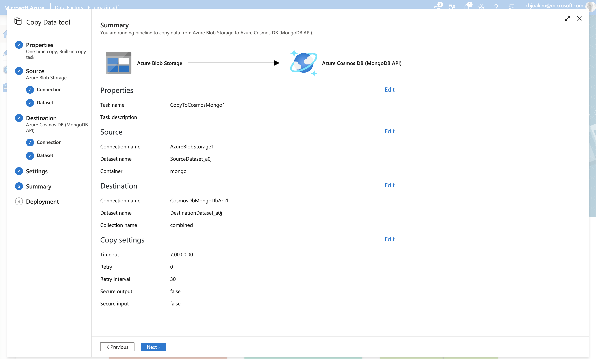
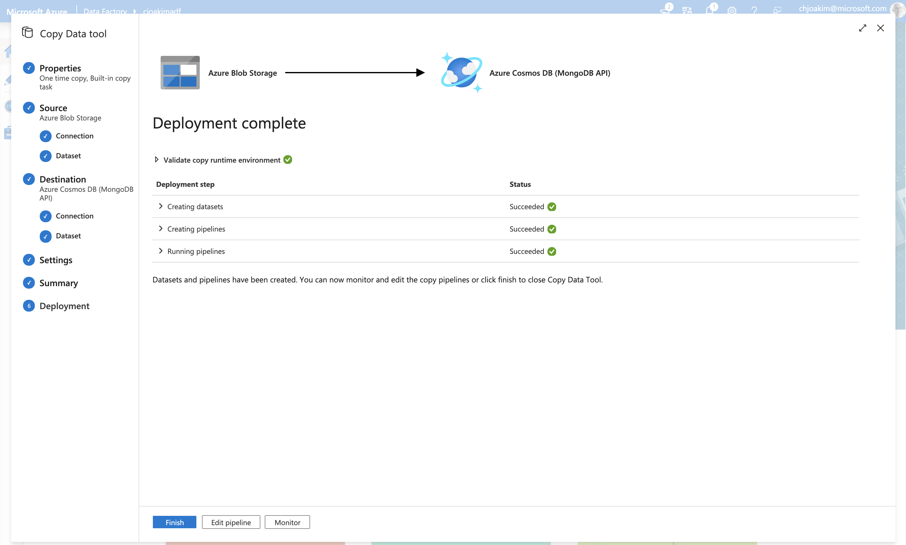
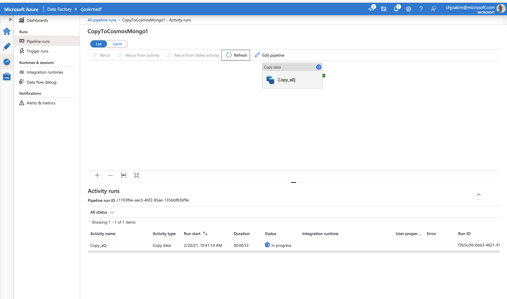
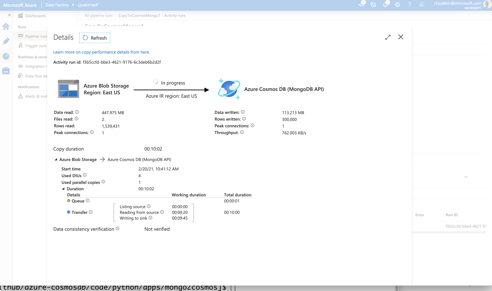
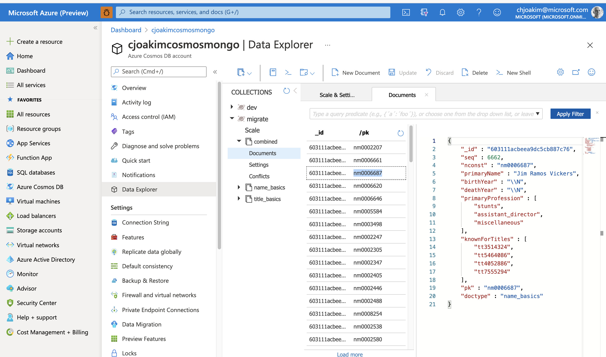
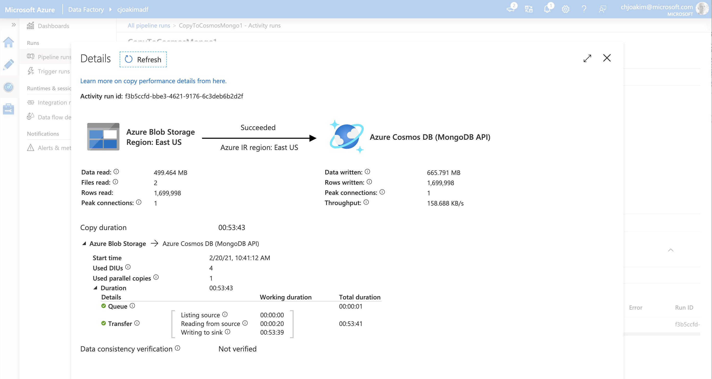

# MongoDB-to-CosmosDB/Mongo Migration

## Process

- Extract the **metadata** about the source MongoDB database
  - See **mongo_metadata.py**

- **Generate** shell scripts and other code from the above metadata
  - Generate mongoexport script(s) from source database
  - Generate shell script to transform the source mongoexport files to target files
  - Code generation not yet implemented in this repo; pending customer details
  - Python and [Jinja templates](https://palletsprojects.com/p/jinja/) are perfect for this

- **Execute the mongoexport file Transformations**
  - Simple and fast Python code can be used for this
    - Read the source mongoexport file
    - Add the pk and doctype attributes
    - Do other transformations as necessary
    - Produce a mongoexport file in the format for the target database
    - Repeat as necessary for each collection and mongoexport file
    - Yes, use code generation
  - See **transform_mongoexports.sh** and **transform_mongoexports.py**
    - Transform a 1-million row file in under 12-seconds

  - Note: this repo uses **IMDb** as large dataset for testing purposes
    - This is a large public domain dataset
    - Download the data with script data/imdb/curl_get_imdb_datasets.sh
    - See **wrangle_imdb.sh** and **wrangle_imdb.py** which reads the IMDb TSV files and transforms them into a working mongoexport format
    - Using this IMDb data simulates a large customer database

- **Create the CosmosDB Target Database, Collections, Indexes**
  - Create the CosmosDB account, database, and set the shared throughput (Azure Portal)
  - Execute generated scripts to create the collections and indexes
  - See examples: **mongo_init.sh** and **mongo/azure_init.ddl**

- **Import the transformed mongoexport files into CosmosDB**
  - One approach is to use the **mongoimport** utility
    - See **mongo_load.sh**
  - Another approach is to use **Azure Data Factory**
    - See screen shots below
    - Source is the transformed mongoexport file(s) in **Azure Blob Storage**
      - [Azure Storage Explorer](https://azure.microsoft.com/en-us/features/storage-explorer/)
    - Target is the CosmosDB/Mongo database collection
  - Another approach is to use a programming language SDK to load CosmosDB from the transformed mongoexport files (DotNet, Java, Python/pymongo, Node, etc)

---

### metadata extract

Use Python/pymongo to extract metadata about the source database -
its collections, document counts, and indices.

```
$ python mongo_metadata.py read_db_metadata <conn-str-env-var> <db-name>
$ python mongo_metadata.py read_db_metadata MONGODB_LOCAL_CONN_STR migrate
```

See example file data/meta/migrate_metadata.json

---

### metadata-driven script generation

Use Python and Jinja templates to create mongoexport and transformation
scripts from the extracted metadata.

```
$ python mongo_metadata.py generate_scripts migrate
generate_scripts, dbname: migrate
file written: generated/migrate_db_mongoexport.sh
file written: generated/migrate_db_transform.sh
```

---

### mongoexport transformations

#### 

Execute the transformation job.  1.7m rows in 20.34 seconds.
See **transform_mongoexports.sh** and **transform_mongoexports.py**

```
$  wc -l data/mongo/name_basics_small_source.json
  999999 data/mongo/name_basics_small_source.json

$ wc -l data/mongo/title_basics_small_source.json
  699999 data/mongo/title_basics_small_source.json

$ ./transform_mongoexports.sh

transform: name_basics -> data/mongo/name_basics_small_source.json -> data/mongo/name_basics_small_target.json
doctype:  name_basics
infile:   data/mongo/name_basics_small_source.json
outfile:  data/mongo/name_basics_small_target.json
elapsed:  11.50761604309082

transform: title_basics -> data/mongo/title_basics_small_source.json -> data/mongo/title_basics_small_target.json
doctype:  title_basics
infile:   data/mongo/title_basics_small_source.json
outfile:  data/mongo/title_basics_small_target.json
elapsed:  8.83965516090393
```

#### Example of original/source file; pretty-printed first row

```
$ head -1 data/mongo/name_basics_small_source.json | jq 

{
  "_id": "603111acbeea9dc5cb886271",
  "seq": 1,
  "nconst": "nm0000001",
  "primaryName": "Fred Astaire",
  "birthYear": "1899",
  "deathYear": "1987",
  "primaryProfession": "soundtrack,actor,miscellaneous",
  "knownForTitles": "tt0053137,tt0072308,tt0031983,tt0050419"
}
```

#### Example of transformed file; pretty-printed first row

Transformation add the **pk** and **doctype** attributes, delimited strings become arrays.

```
$ head -1 data/mongo/name_basics_small_target.json | jq 

{
  "_id": "603111acbeea9dc5cb886271",
  "seq": 1,
  "nconst": "nm0000001",
  "primaryName": "Fred Astaire",
  "birthYear": "1899",
  "deathYear": "1987",
  "primaryProfession": [
    "soundtrack",
    "actor",
    "miscellaneous"
  ],
  "knownForTitles": [
    "tt0053137",
    "tt0072308",
    "tt0031983",
    "tt0050419"
  ],
  "pk": "nm0000001",
  "doctype": "name_basics"
}
```

---

### mongoimport

Use **--numInsertionWorkers** and **--batchSize 24** to throttle throughput.

```
mongoimport --db migrate --collection title_basics \
    --file data/mongo/title_basics_mini_target.json \
    --numInsertionWorkers 1 --batchSize 24 
```

---

### Azure Data Factory (ADF)

The following are screen-shots of creating and executing an ADF Copy job.

#### Create the ADF Copy Job

<p align="center"></p>

---

#### ADF Copy Job is Deployed

<p align="center"></p>

---

#### ADF Copy Job Running

<p align="center"></p>

---

#### ADF Copy Job Running - click into Details

<p align="center"></p>

---

#### View Documents in CosmosDB as the Job is Running

<p align="center"></p>

---

#### ADF Copy Job Completed Successfully

Note the exact record count, 1,699,998.  ADF is solid.

<p align="center"></p>

---

#### Connect to CosmosDB with the mongo shell program to verify

```
$ ./mongo_shell.sh azure
```

```
MongoDB server version: 3.6.0

globaldb:PRIMARY> show dbs
dev      0.000GB
migrate  0.000GB

globaldb:PRIMARY> use migrate
switched to db migrate

globaldb:PRIMARY> show collections
combined
name_basics
title_basics

globaldb:PRIMARY> db.combined.count()
1699998

globaldb:PRIMARY> db.combined.findOne()
{
	"_id" : "603111acbeea9dc5cb886b0d",
	"seq" : 2205,
	"nconst" : "nm0002207",
	"primaryName" : "Richard Franklin",
	"birthYear" : "1948",
	"deathYear" : "2007",
	"primaryProfession" : [
		"director",
		"producer",
		"writer"
	],
	"knownForTitles" : [
		"tt0080453",
		"tt0078067",
		"tt0091415",
		"tt0113337"
	],
	"pk" : "nm0002207",
	"doctype" : "name_basics"
}
globaldb:PRIMARY>
```

---

## Environment Variables

This repo uses the following environment variables; configuration isn't hard-coded
in the scripts or code.

```
AZURE_COSMOSDB_MONGODB_CONN_STRING= ... see Azure Portal for value ...
AZURE_COSMOSDB_MONGODB_DBNAME=migrate
AZURE_COSMOSDB_MONGODB_HOST=cjoakimcosmosmongo.mongo.cosmos.azure.com
AZURE_COSMOSDB_MONGODB_PASS=... see Azure Portal for value ...
AZURE_COSMOSDB_MONGODB_PORT=10255
AZURE_COSMOSDB_MONGODB_USER=cjoakimcosmosmongo
MONGODB_LOCAL_URL=localhost:27017/dev
```
