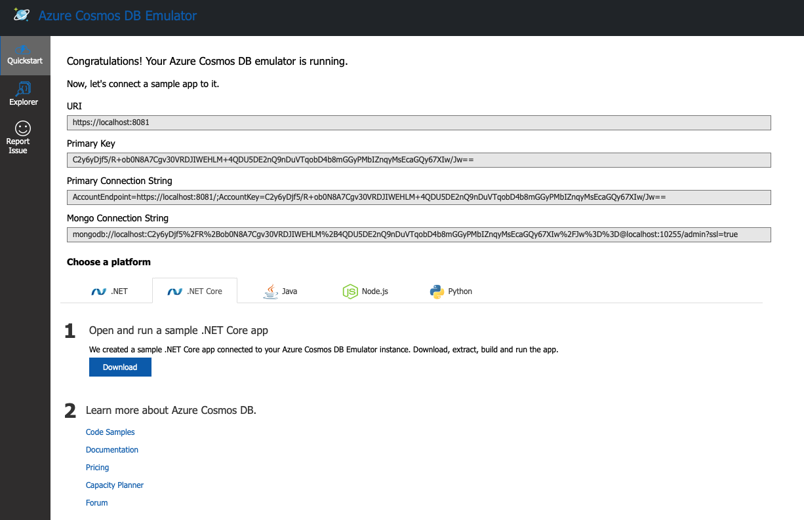

# CosmosDB Emulator

## Links

- https://docs.microsoft.com/en-us/azure/cosmos-db/linux-emulator?tabs=ssl-netstd21

## Docker Image

```
$ docker pull mcr.microsoft.com/cosmosdb/linux/azure-cosmos-emulator
```

## Start the Container

```
$ docker run \
    -p 8081:8081 \
    -p 10251:10251 \
    -p 10252:10252 \
    -p 10253:10253 \
    -p 10254:10254 \
    -m 3g \
    --cpus=2.0 \
    --name=test-linux-emulator \
    -e AZURE_COSMOS_EMULATOR_PARTITION_COUNT=10 \
    -e AZURE_COSMOS_EMULATOR_ENABLE_DATA_PERSISTENCE=true \
    -e AZURE_COSMOS_EMULATOR_IP_ADDRESS_OVERRIDE=$ipaddr \
    -it mcr.microsoft.com/cosmosdb/linux/azure-cosmos-emulator
```

### Get and install the certificate

```
$ curl -k https://$ipaddr:8081/_explorer/emulator.pem > emulatorcert.crt
```

See https://docs.microsoft.com/en-us/azure/cosmos-db/linux-emulator?tabs=ssl-netstd21

## Web UI

- Visit https://localhost:8081/_explorer/index.html

<p align="center"></p>

## Shell Script

[cosmos_emulator.sh](cosmos_emulator.sh)
