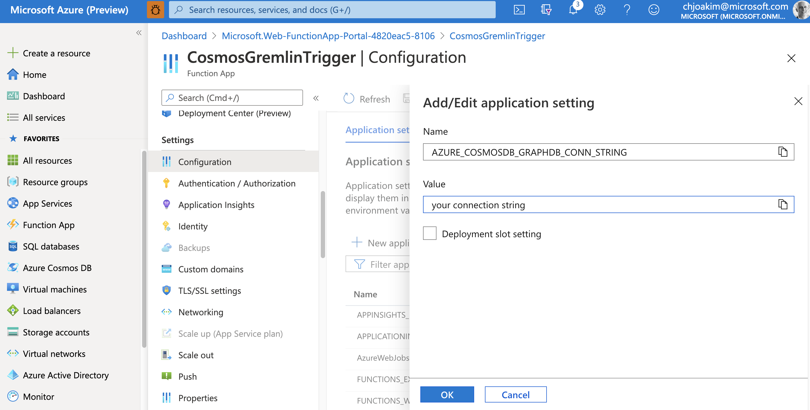

# azure-cosmos-change-feed-gremlin

Consume the CosmosDB/Gremlin Change Feed with an Azure Function

---

## Steps to Create, Test, Deploy

### Provision an Azure CosmosDB Account, with Graph/Gremlin API

- Capture the connection string value in Azure Portal.  CosmosDB Account -> Settings -> Keys
- Set local environment variable **AZURE_COSMOSDB_GRAPHDB_CONN_STRING** to that string value

### Created a graph named **npm** in the **dev** database in CosmosDB, with partition key **/pk**

- I typically use **/pk** as the partition key for all of my CosmosDB containers/collections/graphs

### Create an Azure Functions App on your workstation in Visual Studio

- I used VS for macOS
- Created a new Azure Functions project called **CosmosGremlinTrigger**
- Added minor edits to **CosmosGremlinTrigger.cs** to iterate the changed documents and log them as JSON.
- Added the following line to **CosmosGremlinTrigger.cs** to automatically create the **leases** collection:
```
CreateLeaseCollectionIfNotExists = true,
```
- Build the project on the command line:
```
$ dotnet restore
$ dotnet build
...
Build succeeded.
    0 Warning(s)
    0 Error(s)
```

### Execute the Function App Locally with the Azure Function Tools V3

- See https://docs.microsoft.com/en-us/azure/azure-functions/functions-run-local

```
$ func start
...
Azure Functions Core Tools
Core Tools Version:       3.0.2996 Commit hash: c54cdc36323e9543ba11fb61dd107616e9022bba
Function Runtime Version: 3.0.14916.0

Functions:
	CosmosGremlinTrigger: cosmosDBTrigger
...
```

#### Add a Vertex to the Graph, the Locally Running Function Logs it

For example, with this Gremlin statement.  You can execute this statement either in
Azure Portal or with code.

```
g.addV('library').property('pk','@azure|event-hubs').property('id','@azure|event-hubs').property('desc','Azure Event Hubs SDK for JS.').property('name','@azure/event-hubs')
```

This gets logged by the Locally Running Azure Function:

```
[2021-01-21T19:03:38.427Z] Documents modified 1
[2021-01-21T19:03:38.427Z] Document Id @azure|event-hubs
[2021-01-21T19:03:38.435Z] {
[2021-01-21T19:03:38.435Z]   "AttachmentsLink": "dbs/uY8bAA==/colls/uY8bALgik0U=/docs/uY8bALgik0UdAAAAAAAAAA==/attachments/",
[2021-01-21T19:03:38.435Z]   "TimeToLive": null,
[2021-01-21T19:03:38.435Z]   "Id": "@azure|event-hubs",
[2021-01-21T19:03:38.435Z]   "ResourceId": "uY8bALgik0UdAAAAAAAAAA==",
[2021-01-21T19:03:38.435Z]   "SelfLink": "dbs/uY8bAA==/colls/uY8bALgik0U=/docs/uY8bALgik0UdAAAAAAAAAA==/",
[2021-01-21T19:03:38.435Z]   "AltLink": "dbs/dev/colls/npm/docs/@azure|event-hubs",
[2021-01-21T19:03:38.435Z]   "Timestamp": "2021-01-21T18:55:00Z",
[2021-01-21T19:03:38.435Z]   "ETag": "\u00225e0059f1-0000-0100-0000-6009ce040000\u0022"
[2021-01-21T19:03:38.435Z] }
```

---

#### Create an Azure Function App in Azure Portal

<p align="center" width="95%">
  
</p>

Be sure to add a configuration setting for **AZURE_COSMOSDB_GRAPHDB_CONN_STRING**

<p align="center" width="95%">
  
</p>


Open a Web Browser tab to the Monitor view for your Function (see screen shot below)

---

#### Deploy the Function to Azure with the Azure Function Tools V3

```
$ func azure functionapp publish CosmosGremlinTrigger
...
Getting site publishing info...
Creating archive for current directory...
Uploading 3.98 MB [###############################################################################]
Upload completed successfully.
Deployment completed successfully.
Syncing triggers...
Functions in CosmosGremlinTrigger:
    CosmosGremlinTrigger - [cosmosDBTrigger]
```

#### Update your CosmosDB Graph

One way to do this is in the Azure Portal UI, with a Gremlin statement, as shown below.

<p align="center" width="95%">
  
</p>

Here are some sample Gremlin commands to create Vertices:
```
g.addV('library').property('pk','@azure|amqp-common').property('id','@azure|amqp-common').property('desc','Common library for amqp based azure sdks like @azure|event-hubs.').property('name','@azure/amqp-common')
g.addV('library').property('pk','@azure|cosmos').property('id','@azure|cosmos').property('desc','Azure Cosmos DB Service Node.js SDK for SQL API').property('name','@azure/cosmos')
g.addV('library').property('pk','@azure|cosmos-sign').property('id','@azure|cosmos-sign').property('desc','Utility for signing Azure Cosmos keys').property('name','@azure/cosmos-sign')
g.addV('library').property('pk','@azure|event-hubs').property('id','@azure|event-hubs').property('desc','Azure Event Hubs SDK for JS.').property('name','@azure/event-hubs')
g.addV('library').property('pk','@azure|ms-rest-azure-env').property('id','@azure|ms-rest-azure-env').property('desc','Isomorphic library that provides Azure endpoints for different Azure Environments|Clouds.').property('name','@azure/ms-rest-azure-env')
g.addV('library').property('pk','@azure|ms-rest-js').property('id','@azure|ms-rest-js').property('desc','Isomorphic client Runtime for Typescript|node.js|browser javascript client libraries generated using AutoRest').property('name','@azure/ms-rest-js')
g.addV('library').property('pk','@azure|ms-rest-nodeauth').property('id','@azure|ms-rest-nodeauth').property('desc','Azure Authentication library in node.js with type definitions.').property('name','@azure/ms-rest-nodeauth')
g.addV('library').property('pk','@azure|storage-blob').property('id','@azure|storage-blob').property('desc','Microsoft Azure Storage SDK for JavaScript - Blob').property('name','@azure/storage-blob')
```

---

#### Notice that the Azure Function App was triggered, per the Monitor view in Azure Portal

<p align="center" width="95%">
  
</p>

---

## Other Repos

- https://github.com/Azure-Samples/azure-cosmos-db-graph-npm-bom-sample
