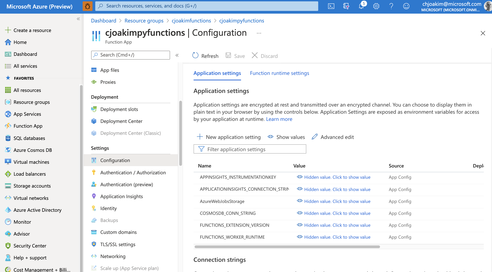
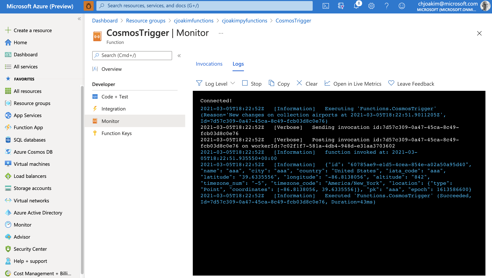

# Consume a CosmosDB Change-Feed with an Azure Function Implemented in Python

### Manually Provision the Function App in Azure Portal 

Create a Functions App named, for example, **cjoakimpyfunctions**.

<p align="center" width="95%">
  
</p>

---

<p align="center" width="95%">
  
</p>

---

<p align="center" width="95%">
  
</p>

---

Define an Application Setting in your Function App which will contain the CosmosDB
connection string value.  I called this setting **COSMOSDB_CONN_STRING**.
It's value will look like this:

```
AccountEndpoint=https://your-account-name.documents.azure.com:443/;AccountKey=your-account-key
```

<p align="center" width="95%">
  
</p>


### Create the Python-based Azure Function App with the CLI tools

These steps use the [Azure Function Tools](https://docs.microsoft.com/en-us/azure/azure-functions/functions-run-local)

```
$ func init --help

$ func --version
3.0.2996

$ func extensions install

$ func init PyFunctionApp --worker-runtime python

$ cd PyFunctionApp

$ func new
Select a number for template:
1. Azure Blob Storage trigger
2. Azure Cosmos DB trigger
3. Durable Functions activity
4. Durable Functions HTTP starter
5. Durable Functions orchestrator
6. Azure Event Grid trigger
7. Azure Event Hub trigger
8. HTTP trigger
9. Azure Queue Storage trigger
10. RabbitMQ trigger
11. Azure Service Bus Queue trigger
12. Azure Service Bus Topic trigger
13. Timer trigger
Choose option: 2
Azure Cosmos DB trigger
Function name: [CosmosTrigger]
...
The function "CosmosTrigger" was created successfully from the "Azure Cosmos DB trigger" template.
```


#### Edit the requirements.txt file

**arrow** was added as an example of using additional third-party libraries on PyPI 
(see https://pypi.org/).

```
arrow
azure-functions
```


#### Edit the Function Code, file __init__.py

Here, I altered the generated code to log the UTC timestamp with arrow, then iterate 
the given list of triggering documents and log each one.

```
import arrow
import logging
import azure.functions as func


def main(documents: func.DocumentList) -> str:
    utc = arrow.utcnow()
    logging.info('function invoked at: {}'.format(str(utc)))
    
    if documents:
        for doc in documents:
            #logging.info('Document id: %s', documents[0]['id'])
            logging.info(doc.to_json())

```

#### Edit the host.json file to enable Application Insights Logging

```
...
  "logging": {
    "applicationInsights": {
      "samplingSettings": {
        "isEnabled": true,
        "excludedTypes": "Request"
      }
    }
  },
...
```

#### Edit the function.json file

Specify your own leaseCollectionName, connectionStringSetting, databaseName, 
and collectionName values.

Notice how the binding variable **connectionStringSetting** refers to the **COSMOSDB_CONN_STRING** Application Setting **name** we defined above.  It does **not** contain the actual connection string
value.

```
{
  "scriptFile": "__init__.py",
  "bindings": [
    {
      "type": "cosmosDBTrigger",
      "name": "documents",
      "direction": "in",
      "leaseCollectionName": "leases",
      "connectionStringSetting": "COSMOSDB_CONN_STRING",
      "databaseName": "dev",
      "collectionName": "airports",
      "createLeaseCollectionIfNotExists": true
    }
  ]
}
```

#### Edit the deploy.sh script

Set the app_name to **cjoakimpyfunctions**, as created in Azure Portal
per the above screen shots.


#### Fetch the Settings from your Azure Functions App

This enables you to run the app locally with the func CLI tools.

```
$ cd PyFunctionApp

$ func azure functionapp fetch-app-settings <your-app-name>
```

Notice that file **local.settings.json** is now on your computer, and it includes
the database connection string in Application Setting **COSMOSDB_CONN_STRING**.
This file should be "git ignored" for security reasons.

#### Run the Function Locally with the CLI Tooling

```
$ func start
Found Python version 3.7.9 (python3).

Azure Functions Core Tools
Core Tools Version:       3.0.2996 Commit hash: c54cdc36323e9543ba11fb61dd107616e9022bba
Function Runtime Version: 3.0.14916.0

[2021-03-05T17:38:13.218Z] Worker process started and initialized.

Functions:

	CosmosTrigger: cosmosDBTrigger

For detailed output, run func with --verbose flag.
[2021-03-05T17:38:20.004Z] Host lock lease acquired by instance ID '000000000000000000000000594B3B8D'.
```

Per the above output, your Azure Function is now running locally.

To trigger it, in your CosmosDB account in Azure Portal, upload a JSON document to
your container.  For example, file docs/aaa.json in this repo, and see how the 
locally-running Function is triggered by the new document and logs it as shown below:

```
[2021-03-05T17:39:26.252Z] Executing 'Functions.CosmosTrigger' (Reason='New changes on collection airports at 2021-03-05T17:39:26.2063370Z', Id=bc762362-5876-4af4-912e-e1707b8a952a)
[2021-03-05T17:39:26.286Z] function invoked at: 2021-03-05T17:39:26.282400+00:00
[2021-03-05T17:39:26.289Z] {"id": "487f5175-3237-4672-bb05-be5803e1f099", "name": "aaa", "city": "aaa", "country": "United States", "iata_code": "aaa", "latitude": "39.6335556", "longitude": "-86.8138056", "altitude": "842", "timezone_num": "-5", "timezone_code": "America/New_York", "location": {"type": "Point", "coordinates": [-86.8138056, 39.6335556]}, "pk": "aaa", "epoch": 1613586600}
[2021-03-05T17:39:26.310Z] Executed 'Functions.CosmosTrigger' (Succeeded, Id=bc762362-5876-4af4-912e-e1707b8a952a, Duration=95ms)
```

### Deploy the Function to Azure

```
$ func azure functionapp publish <your-function-app-name>

Getting site publishing info...
Creating archive for current directory...
Performing remote build for functions project.
Deleting the old .python_packages directory
Uploading 3.78 KB [###############################################################################]
Remote build in progress, please wait...
Updating submodules.
Preparing deployment for commit id 'a387d9bfbc'.
Repository path is /tmp/zipdeploy/extracted
Running oryx build...

...

Running pip install...

...

Deployment successful.
Remote build succeeded!
Syncing triggers...
Functions in cjoakimpyfunctions:
    CosmosTrigger - [cosmosDBTrigger]
```

### Monitor the Deployed Function in Azure Portal

<p align="center" width="95%">
  
</p>
