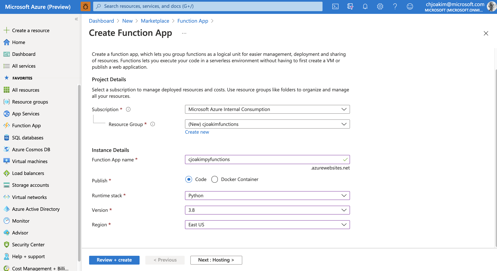
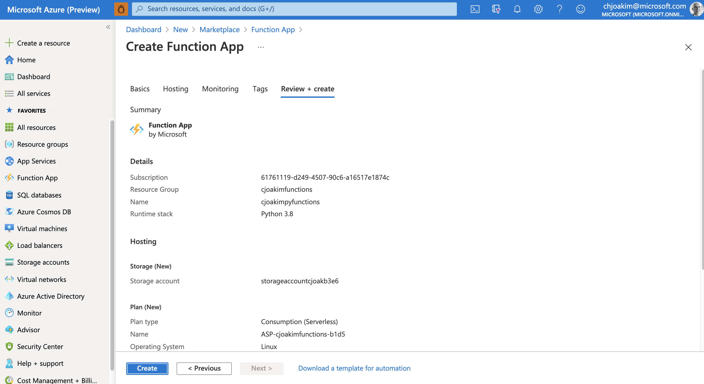
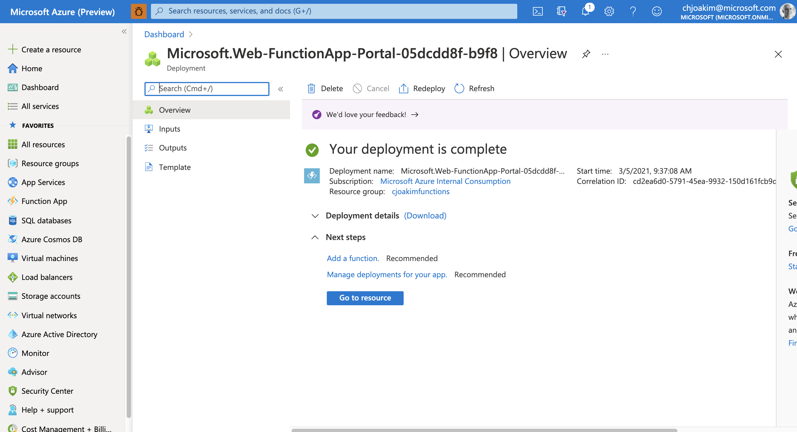

# Consume a CosmosDB Change-Feed with an Azure Function Implemented in Python

### Manually Provision the Function App in Azure Portal 

<p align="center" width="95%">
  
</p>

---

<p align="center" width="95%">
  
</p>

---

<p align="center" width="95%">
  
</p>

### Create the Python-based Azure Function App with the CLI tools

These steps use the [Azure Function Tools](https://docs.microsoft.com/en-us/azure/azure-functions/functions-run-local)

```
$ func init --help

$ func --version
3.0.2996

$ func extensions install

$ func init PyFunctionApp --worker-runtime python

$ cd PyFunctionApp

$ func new
Select a number for template:
1. Azure Blob Storage trigger
2. Azure Cosmos DB trigger
3. Durable Functions activity
4. Durable Functions HTTP starter
5. Durable Functions orchestrator
6. Azure Event Grid trigger
7. Azure Event Hub trigger
8. HTTP trigger
9. Azure Queue Storage trigger
10. RabbitMQ trigger
11. Azure Service Bus Queue trigger
12. Azure Service Bus Topic trigger
13. Timer trigger
Choose option: 2
Azure Cosmos DB trigger
Function name: [CosmosTrigger]
...
The function "CosmosTrigger" was created successfully from the "Azure Cosmos DB trigger" template.
```

#### Edit the host.json file to enable Application Insights Logging

```
...
  "logging": {
    "applicationInsights": {
      "samplingSettings": {
        "isEnabled": true,
        "excludedTypes": "Request"
      }
    }
  },
...
```


#### Edit the function.json file

Specify your own **connectionStringSetting** value.

```
{
  "scriptFile": "__init__.py",
  "bindings": [
    {
      "type": "cosmosDBTrigger",
      "name": "documents",
      "direction": "in",
      "leaseCollectionName": "leases",
      "connectionStringSetting": "...secret...",
      "databaseName": "dev",
      "collectionName": "airports",
      "createLeaseCollectionIfNotExists": true
    }
  ]
}
```