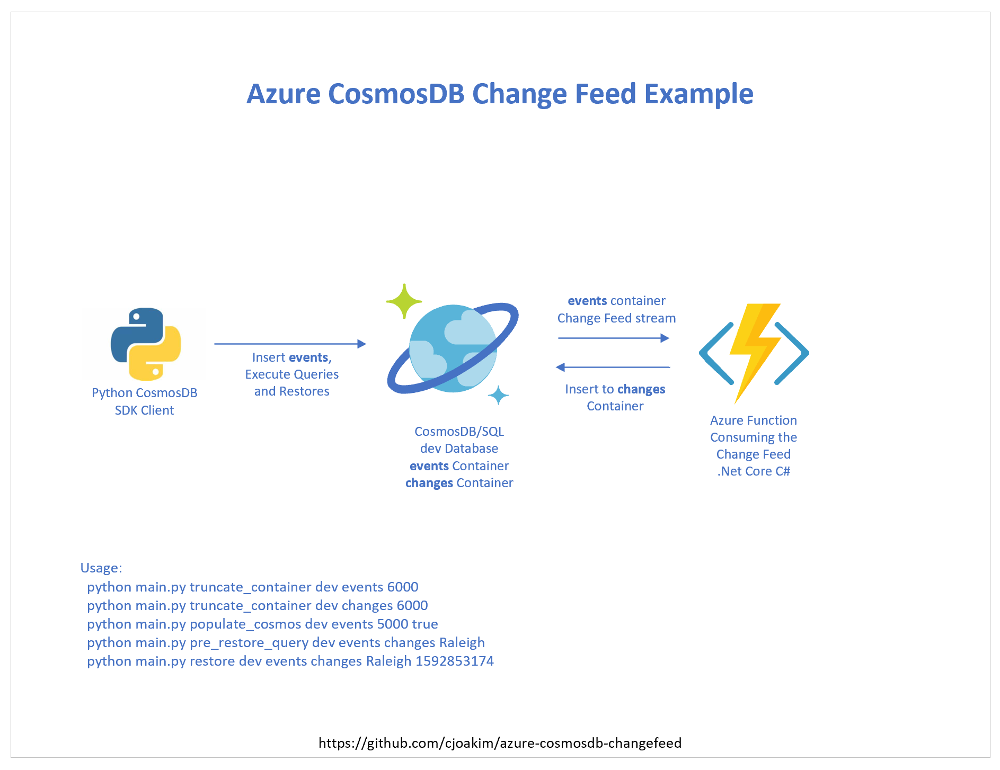
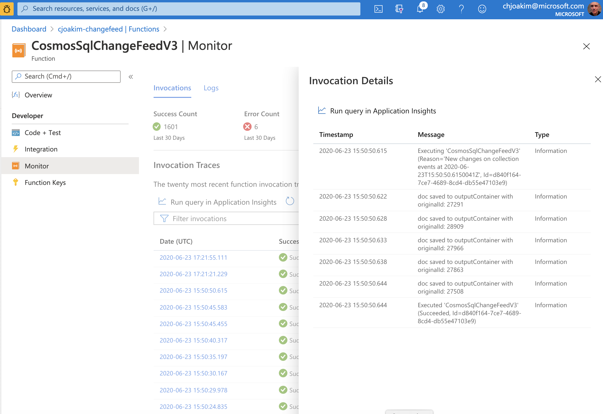

# azure-cosmosdb-changefeed

An implementation of consuming the CosmosDB Change-Feed stream, using another container
in the same database as the sink for the stream.

The example repo contains the following:
- Azure Function, implemented in .Net Core/C#.
- CosmosDB test client, implemented in Python 3.

<p align="center">
  
</p>

This repo also explores two custom database restore processes:
- Using the CosmosDB Change-Feed and the changes collection
- Using Application-Created Backup Files

---

## Azure Provisioning

Create the following in Azure Portal

1) A CosmosDB/SQL account
2) A database named **dev** within the CosmosDB account
3) Collections named **events** and **changes** in the **dev** database
4) Set the partition key for both collections to **/pk**, RU value 1000, and default indexing
5) An Azure Function App, using **.Net Core** as the Runtime Stack

## Development Environments 

This app was created on Windows 10 with the Visual Studio IDE to author and publish/deploy 
the **Azure Function**.

The **CosmosDB test client** is implemented in Python 3, created and executed on macOS
with the Visual Studio Code editor.

This choice was intentional - to demonstrate interacting with Azure and CosmosDB
from multiple operating systems and programming languages.

Azure Functions can be implemented in many ways (IDE, CLI) and in one of several 
programming languages.  They can even be containerized.  Likewise, there are SDKs
for CosmosDB/SQL in several programming languages.  This repository demonstrates 
just one of these many possibilities.

The Azure Function code is in the **/CosmosSqlChangeFeedV3** directory in this repository,
while the Python CosmosDB client code is in the **/py** directory.

## Data Flow in this Demonstration App

- Python client CLI program generates and upserts randomized North Carolina
  Postal Code documents in the **events** container.  The document id and pk are the zip code.
- Azure Function consumes the stream of the CosmosDB/SQL change feed documents from the
  **events** container and persists them in the **changes** container in the same database.
- Python client CLI program can query both collections to identify restore candidates.
- Python client CLI program can selectively restore documents from the **changes** container
  into the **events** container.

---

## Processing Examples

### Python Client Setup

```
$ git clone https://github.com/cjoakim/azure-cosmosdb-changefeed.git
$ cd azure-cosmosdb-changefeed    
$ cd py                          # <-- the python client code is in this directory
$ ./venv.sh create               # <-- create the python virtual environment, install PyPI libs
$ source bin/activate            # <-- activate the python virtual environment
$ pip list                       # <-- list the python libraries, your output should be similar
Package         Version
--------------- ---------
arrow           0.15.7
azure-core      1.6.0
azure-cosmos    4.0.0
certifi         2020.6.20
chardet         3.0.4
click           7.1.2
docopt          0.6.2
idna            2.9
pip             20.1.1
pip-tools       5.2.1
python-dateutil 2.8.1
requests        2.24.0
setuptools      41.2.0
six             1.15.0
urllib3         1.25.9
```

The primary file is **main.py**, and CosmosDB logic is in file **pysrc/cosmos.py**.
The latest version 4.0.0 of the CosmosDB SDK is used in this project.

### Truncate the Containers - remove all documents from each

The following deletes up to 6000 documents in each container.
```
$ python main.py truncate_container dev events 6000
$ python main.py truncate_container dev changes 6000
```

### Upsert 5000 documents in the events container

This logic executes a loop 5000 times and randomly selects and augments
a North Carolina zip code in file **data/nc_zipcodes.json** in each iteration
of the loop.  The zip code value (i.e. - 20836) is used as both the **id**
and the **pk** of the **upserted** documents.  Since there are only 1075 zip codes 
in the file, some of the iterations are inserts while others are updates.

Note: It is typically not recommended to explicitly set the **id** attribute
of your CosmosDB documents, as CosmosDB will generate these values for you.
The id values are set in this demo app simply to cause many updates to occur.


```
$ python main.py populate_cosmos_zipcodes dev events 5000 true
```

Example output of Document sent to CosmosDB:
```
...
{
    "location": {
        "type": "Point",
        "coordinates": [
            -80.797854,
            35.483306
        ]
    },
    "postal_cd": "28036",
    "country_cd": "US",
    "city_name": "Davidson",
    "state_abbrv": "NC",
    "latitude": 35.483306,
    "longitude": -80.797854,
    "id": "28036",
    "pk": "28036",
    "seq": 3644,
    "doctype": "zipcode",
    "timestamp": "2020-06-23 15:43:28",
    "epoch": 1592927008
}
...

```

Corresponding example document with CosmosDB generated attributes.
```
{
    "location": {
        "type": "Point",
        "coordinates": [
            -80.797854,
            35.483306
        ]
    },
    "postal_cd": "28036",
    "country_cd": "US",
    "city_name": "Davidson",
    "state_abbrv": "NC",
    "latitude": 35.483306,
    "longitude": -80.797854,
    "id": "28036",
    "pk": "28036",
    "seq": 3644,
    "doctype": "zipcode",
    "timestamp": "2020-06-23 15:43:28",
    "epoch": 1592927008,
    "_rid": "47UeAPmUTk0PEQAAAAAAAA==",
    "_self": "dbs/47UeAA==/colls/47UeAPmUTk0=/docs/47UeAPmUTk0PEQAAAAAAAA==/",
    "_etag": "\"000059be-0000-0100-0000-5ef223200000\"",
    "_attachments": "attachments/",
    "_ts": 1592927008
}
```

## Azure Function Invocations

In Azure Portal, we can see that our CosmosSqlChangeFeedV3 Function has executed many
times as a result of consuming the CosmosDB Change-Feed.  We can click into any instance
to see the information logged by the Azure Function for that invocation.

<p align="center">
  
</p>

---

## Restore Alternative 1 - from the Change-Feed changes container

Different customers and applications will use the CosmosDB Change Feed functionality
for different purposes.  Some customers may wish to use it in order to do 
**surgical restores** of given documents; that's what this demonstration app implements.

For example, suppose we want to restore a version of a document for Davidson, NC.
We can then query the DB with Python as follows:

```
$ python main.py pre_restore_query dev events changes Davidson
...
1592926406,changes,28035,28035,Davidson
1592926416,changes,28035,28035,Davidson
1592926427,changes,28036,28036,Davidson
1592926489,changes,28035,28035,Davidson
1592926494,changes,28036,28036,Davidson
1592926509,changes,28035,28035,Davidson
1592926612,changes,28035,28035,Davidson
1592926627,changes,28035,28035,Davidson
1592926844,events,28035,28035,Davidson
1592926848,changes,28035,28035,Davidson
1592927008,events,28036,28036,Davidson
1592927013,changes,28036,28036,Davidson
```

This output shows that the **events** collection has two documents for Davidson, the most recent
versions for 28035 and 28036.

The output also shows several historical/snapshots of these documents that are in the
**changes** collection.

Let's assume that a system user comes to us to inform us that the documents for Davidson are
incorrect in some way, so let's query them in the **events** container in Azure Portal:

```
Query: SELECT * FROM c where c.city_name = 'Davidson'

Output:
[
    {
        "location": {
            "type": "Point",
            "coordinates": [
                -80.8433,
                35.5095
            ]
        },
        "postal_cd": "28035",
        "country_cd": "US",
        "city_name": "Davidson",
        "state_abbrv": "NC",
        "latitude": 35.5095,
        "longitude": -80.8433,
        "id": "28035",
        "pk": "28035",
        "seq": 3139,
        "doctype": "zipcode",
        "timestamp": "2020-06-23 15:40:44",
        "epoch": 1592926844,
        "_rid": "47UeAPmUTk0GEQAAAAAAAA==",
        "_self": "dbs/47UeAA==/colls/47UeAPmUTk0=/docs/47UeAPmUTk0GEQAAAAAAAA==/",
        "_etag": "\"000011bc-0000-0100-0000-5ef2227c0000\"",
        "_attachments": "attachments/",
        "_ts": 1592926844
    },
    {
        "location": {
            "type": "Point",
            "coordinates": [
                -80.797854,
                35.483306
            ]
        },
        "postal_cd": "28036",
        "country_cd": "US",
        "city_name": "Davidson",
        "state_abbrv": "NC",
        "latitude": 35.483306,
        "longitude": -80.797854,
        "id": "28036",
        "pk": "28036",
        "seq": 3644,
        "doctype": "zipcode",
        "timestamp": "2020-06-23 15:43:28",
        "epoch": 1592927008,
        "_rid": "47UeAPmUTk0PEQAAAAAAAA==",
        "_self": "dbs/47UeAA==/colls/47UeAPmUTk0=/docs/47UeAPmUTk0PEQAAAAAAAA==/",
        "_etag": "\"000059be-0000-0100-0000-5ef223200000\"",
        "_attachments": "attachments/",
        "_ts": 1592927008
    }
]
```

We similarly query the **changes** container and confirm that the Documents for
Davidson are incorrect in some way after 1592926509.

So let's restore the Davison documents from the **last change prior to epoch timestamp** 
1592926509 using the CosmosDB-generated **_ts** attribute.

```
$ python main.py restore dev events changes Davidson 28035 1592926509 
$ python main.py restore dev events changes Davidson 28036 1592926509 
```

The restore process takes only a few seconds to execute.  After it completes
let's execute the same above query for Davidson in the **events** conllection.
It shows that the Documents indeed have been restored from a previous version.

```
Query: SELECT * FROM c where c.city_name = 'Davidson'

Output:
[
    {
        "id": "28035",
        "_rid": "47UeAPmUTk0GEQAAAAAAAA==",
        "_self": "dbs/47UeAA==/colls/47UeAPmUTk0=/docs/47UeAPmUTk0GEQAAAAAAAA==/",
        "_etag": "\"00000fd9-0000-0100-0000-5ef23a030000\"",
        "location": {
            "type": "Point",
            "coordinates": [
                -80.8433,
                35.5095
            ]
        },
        "postal_cd": "28035",
        "country_cd": "US",
        "city_name": "Davidson",
        "state_abbrv": "NC",
        "latitude": 35.5095,
        "longitude": -80.8433,
        "pk": "28035",
        "seq": 1777,
        "doctype": "zipcode",
        "timestamp": "2020-06-23 15:33:25",    <--- changed
        "epoch": 1592926405,
        "_lsn": 20591,
        "_originalId": "28035",
        "_attachments": "attachments/",
        "restored_at": 1592932867,             <--- added
        "_ts": 1592932867
    },
    {
        "id": "28036",
        "_rid": "47UeAPmUTk0PEQAAAAAAAA==",
        "_self": "dbs/47UeAA==/colls/47UeAPmUTk0=/docs/47UeAPmUTk0PEQAAAAAAAA==/",
        "_etag": "\"000030d9-0000-0100-0000-5ef23a2e0000\"",
        "location": {
            "type": "Point",
            "coordinates": [
                -80.797854,
                35.483306
            ]
        },
        "postal_cd": "28036",
        "country_cd": "US",
        "city_name": "Davidson",
        "state_abbrv": "NC",
        "latitude": 35.483306,
        "longitude": -80.797854,
        "pk": "28036",
        "seq": 1845,
        "doctype": "zipcode",
        "timestamp": "2020-06-23 15:33:46",    <--- changed
        "epoch": 1592926426,
        "_lsn": 20659,
        "_originalId": "28036",
        "_attachments": "attachments/",
        "restored_at": 1592932910,             <--- added
        "_ts": 1592932910
    }
]
```

## Restore Alternative 2 - Application-Created Backup Files

```
$ python main.py backup dev events Davidson 28036

sql: select * from c where c.city_name = 'Davidson'
file written: tmp/backup_davidson.json
```

```
$ cat tmp/backup_davidson.json

[{"id": "28035", "_rid": "47UeAPmUTk0GEQAAAAAAAA==", "_self": "dbs/47UeAA==/colls/47UeAPmUTk0=/docs/47UeAPmUTk0GEQAAAAAAAA==/", "_etag": "\"00000fd9-0000-0100-0000-5ef23a030000\"", "location": {"type": "Point", "coordinates": [-80.8433, 35.5095]}, "postal_cd": "28035", "country_cd": "US", "city_name": "Davidson", "state_abbrv": "NC", "latitude": 35.5095, "longitude": -80.8433, "pk": "28035", "seq": 1777, "doctype": "zipcode", "timestamp": "2020-06-23 15:33:25", "epoch": 1592926405, "_lsn": 20591, "_originalId": "28035", "_attachments": "attachments/", "restored_at": 1592932867, "_ts": 1592932867}, {"id": "28036", "_rid": "47UeAPmUTk0PEQAAAAAAAA==", "_self": "dbs/47UeAA==/colls/47UeAPmUTk0=/docs/47UeAPmUTk0PEQAAAAAAAA==/", "_etag": "\"000030d9-0000-0100-0000-5ef23a2e0000\"", "location": {"type": "Point", "coordinates": [-80.797854, 35.483306]}, "postal_cd": "28036", "country_cd": "US", "city_name": "Davidson", "state_abbrv": "NC", "latitude": 35.483306, "longitude": -80.797854, "pk": "28036", "seq": 1845, "doctype": "zipcode", "timestamp": "2020-06-23 15:33:46", "epoch": 1592926426, "_lsn": 20659, "_originalId": "28036", "_attachments": "attachments/", "restored_at": 1592932910, "_ts": 1592932910}]
```

To restore, simply upsert the documents in a given backup file.
