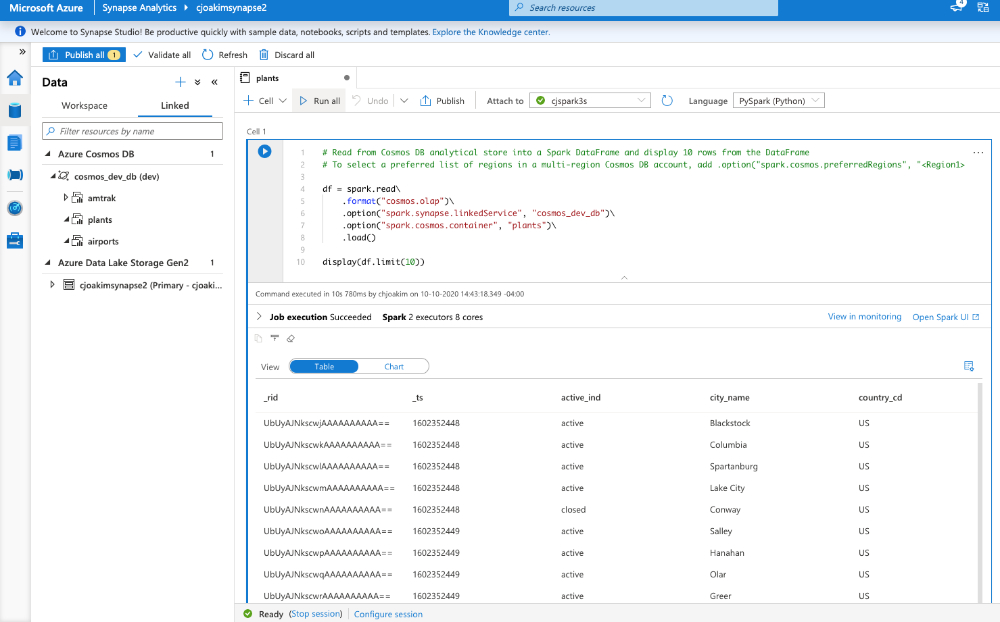
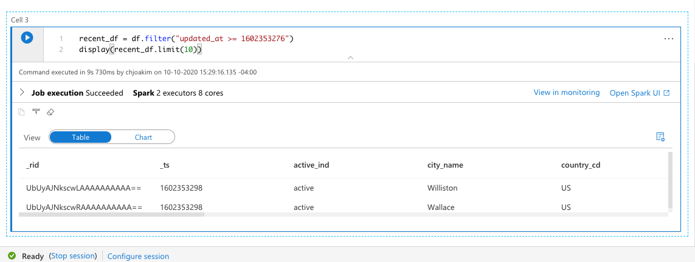

# azure-function-cosmos-synapse-link

## Solution Architecture

[Azure Synapse Link](https://docs.microsoft.com/en-us/azure/cosmos-db/synapse-link)

<p align="center" width="95%">
  
</p>

---

#### Enable the Azure Synapse Link feature in your CosmosDB account

<p align="center" width="95%">
  
</p>

---

#### Documents in CosmosDB after HTTP POSTing to the Azure Function

<p align="center" width="95%">
  
</p>

---

#### Azure Synapse Welcome Page

<p align="center" width="95%">
  
</p>

---

#### Configure the Synapse Link connection to your CosmosDB database

<p align="center" width="95%">
  
</p>

---

#### Create new PySpark Notebook in Azure Synapse Link, pointing to your linked CosmosDB plants container

<p align="center" width="95%">
  
</p>

---

#### Execute the Notebook

<p align="center" width="95%">
  
</p>

---

#### Display the Schema of the Plants Data

<p align="center" width="95%">
  
</p>

---

#### Display the Schema of the Plants Data

<p align="center" width="95%">
  
</p>

#### Useful Links

- https://docs.microsoft.com/en-us/azure/synapse-analytics/get-started-analyze-spark

---

## Deploying this Solution

Assumptions:
- Host commputer is Linux, macOS, or Windows 10 with the Windows Subsystem for Linux (WSL)
  - See https://docs.microsoft.com/en-us/windows/wsl/install-win10
- git is installed
- python 3.7.x is installed
- pyenv is installed
- Azure Function Tools are installed
  - See https://docs.microsoft.com/en-us/azure/azure-functions/functions-run-local
- Azure CLI is installed
  - See https://docs.microsoft.com/en-us/cli/azure/install-azure-cli

### Programming Languages

Python3 is the client-side and Azure Function implementation language, and PySpark is used in Azure Synapse.

The **pyenv** Python Version Management tool is used to manage Python versions and virtual environments;
see the **pyenv.sh** shell scripts in this repo.  See https://realpython.com/intro-to-pyenv/#installing-pyenv

### Provision Azure Resources

- Create an Azure Storage Account in Azure Portal 
- Create an Azure Function App with the Azure CLI
  - see automation/az/functionapp.sh, reference the above storage account 
- Create an Azure CosmosDB account, with SQL API, in Azure Portal
  - Create a database named **dev**, and a container named **plants** with partition key **/pk**
- Create an Azure Synapse Workspace, with Spark Pool, in Azure Portal

- Set environment variables AZURE_COSMOSDB_SQLDB_URI and AZURE_COSMOSDB_SQLDB_KEY
  - Obtain these values in Azure Portal in your CosmosDB Settings --> Keys panel
    - AZURE_COSMOSDB_SQLDB_URI
    - AZURE_COSMOSDB_SQLDB_KEY
  - Set these environment variables both on your workstation and in your Azure Function App

### Clone the Repository

```
$ git clone https://github.com/cjoakim/azure-function-cosmos-synapse-link.git
$ cd azure-function-cosmos-synapse-link

$ mkdir -p pybatch/tmp/ 
```

Copy the FunctionApp directory to another location, since we're going to 
recreate that directory and then copy some original files to it.

Then:
```
$ rm -rf FunctionApp/
```

### Create the Python-based Azure Function App

These steps use the Azure Function Tools.

```
$ func init --help
$ func init FunctionApp --worker-runtime python
$ cd FunctionApp
$ func new --name CosmosPlantsUpdate --template "HTTP trigger"
$ func extensions install
```

Copy the *.sh, *.py, and requirements files from the copied FunctionApp directory
into the new FunctionApp directory.  Be sure to copy file **CosmosPlantsUpdate/__init__.py** - 
the Function implementation file.

Then edit the **fetch_settings.sh** and **deploy.sh** scripts to reference the name of **your** Azure Function name.

Then:
```
$ ./pyenv.sh create
$ func start
Now listening on: http://0.0.0.0:7071
Application started. Press Ctrl+C to shut down.
Functions:
	CosmosPlantsUpdate: [GET,POST] http://localhost:7071/api/CosmosPlantsUpdate
```

Invoke the HTTP Function, running locally, from another Terminal in the pybatch directory:

```
$ python main.py post_to_azure_function local
...
---
response: <Response [200]>
tmp/update_plants_1602351502.json
file written: tmp/update_plants_1602351502.json
```

This returns a HTTP 200 response, with the updated CosmosDB documents.
View the contents of file tmp/update_plants_1602351502.json to confirm correctness.
Note that value 1602351502 was the epoch time value, you will see different filenames.

After you're satisfied with how the Function runs locally, deploy it to Azure:

```
$ func azure functionapp publish your-function-app-name
  - or -
$ ./deploy.sh
```

### POST The Complete set of Manufacturing Plants to the Azure Function 

First, cd to the pybatch directory, and execute these commands:

```
$ cp data/plants_initial.json data/plants.json
```

File **data/plants.json** is read and used as the HTTP POST data to the Azure Function.
This file contains 100 randomly generated simulated **Manfufacturing Plant** documents for cities
in North Carolina, South Carolina, and Georgia.

The Function will only insert/update (i.e - upsert) the documents in that file where
their updated_at value is >= the global **updated_at** value in that file.

So, to insert the initial set of 100 Plants, then update 5 random Plants, then 2 more, run the following:

```
$ python main.py post_to_azure_function azure

$ python main.py random_plant_changes 5
$ python main.py post_to_azure_function azure

$ python main.py random_plant_changes 2
$ python main.py post_to_azure_function azure
```

The initial response JSON will look like this; 100 updates in about 8-seconds:
```
{
  "summary": {
    "elapsed_time": 7.912329196929932,
    "finish_time": 1602352453.9149919,
    "function_version": "2020/10/10 13:44",
    "start_time": 1602352446.0026627,
    "upsert_count": 100
  },
  "upserts": [
  ...
```

The last response JSON will look like this; 2 updates in about 1 second.
```
{
  "summary": {
    "elapsed_time": 1.0190205574035645,
    "finish_time": 1602353298.3209364,
    "function_version": "2020/10/10 13:44",
    "start_time": 1602353297.301916,
    "upsert_count": 2
  },
  "upserts": [
    {
      "_attachments": "attachments/",
      "_etag": "\"04008c9d-0000-0100-0000-5f81f8920000\"",
      "_rid": "UbUyAJNkscwLAAAAAAAAAA==",
      "_self": "dbs/UbUyAA==/colls/UbUyAJNkscw=/docs/UbUyAJNkscwLAAAAAAAAAA==/",
      "_ts": 1602353298,
      "active_ind": "active",
      "city_name": "Williston",
      "country_cd": "US",
      "doctype": "plant",
      "id": "11831",
      "location": {
        "coordinates": [
          -76.499234,
          34.805568
        ],
        "type": "Point"
      },
      "pk": "Williston",
      "plant_address": "197 Cox Ford Light",
      "plant_manager": "Katelyn Hernandez",
      "plant_name": "Williston",
      "postal_cd": "28589",
      "products": [
        "Component_31",
        "Product_82",
        "Component_45",
        "Component_17",
        "Product_87",
        "Component_52"
      ],
      "state_abbrv": "NC",
      "updated_at": 1602353276
    },
    {
      "_attachments": "attachments/",
      "_etag": "\"04008d9d-0000-0100-0000-5f81f8920000\"",
      "_rid": "UbUyAJNkscwRAAAAAAAAAA==",
      "_self": "dbs/UbUyAA==/colls/UbUyAJNkscw=/docs/UbUyAJNkscwRAAAAAAAAAA==/",
      "_ts": 1602353298,
      "active_ind": "active",
      "city_name": "Wallace",
      "country_cd": "US",
      "doctype": "plant",
      "id": "11754",
      "location": {
        "coordinates": [
          -77.939562,
          34.760682
        ],
        "type": "Point"
      },
      "pk": "Wallace",
      "plant_address": "872 Lewis Cliffs Loop",
      "plant_manager": "Patrick Miles",
      "plant_name": "Wallace",
      "postal_cd": "28466",
      "products": [
        "Product_39",
        "Component_68",
        "Component_33",
        "Product_64",
        "Component_51",
        "Product_6"
      ],
      "state_abbrv": "NC",
      "updated_at": 1602353276
    }
  ]
}
```

**These upserted documents in CosmosDB will automatically flow into Synapse via Synapse Link**.

## Other Links

- https://docs.microsoft.com/en-us/azure/synapse-analytics/spark/apache-spark-development-using-notebooks

```

%%pyspark
myNewPythonDataFrame = spark.sql("SELECT * FROM mydataframetable")
```
