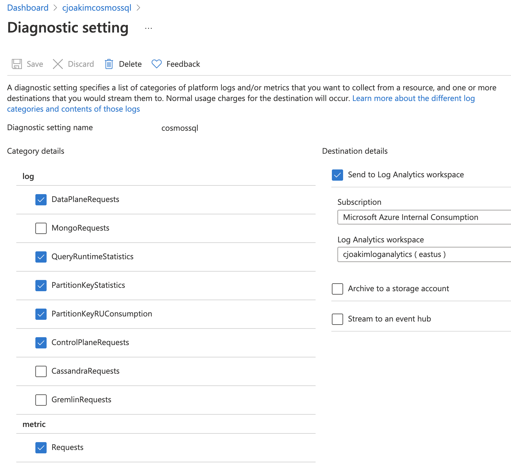

# Log Analytics

## Links

- https://docs.microsoft.com/en-us/azure/cosmos-db/cosmosdb-monitor-resource-logs
- https://docs.microsoft.com/en-us/azure/azure-monitor/essentials/resource-logs-schema#service-specific-schemas
- https://docs.microsoft.com/en-us/azure/cosmos-db/monitor-cosmos-db
- https://docs.microsoft.com/en-us/rest/api/cosmos-db/get-partition-key-ranges
- https://docs.microsoft.com/en-us/azure/cosmos-db/cosmosdb-monitor-resource-logs
- https://docs.microsoft.com/en-us/azure/azure-monitor/logs/log-analytics-tutorial

## CosmosDB/SQL Account Configuration

<p align="center"></p>

---

## Schema 

### Tables

AzureDiagnostics 
AzureMetrics

### Categories


PartitionKeyStatistics
PartitionKeyRUConsumption
DataPlaneRequests

AzureDiagnostics 
| where ResourceProvider=="MICROSOFT.DOCUMENTDB" and Category=="PartitionKeyStatistics"

---

## Examples

```
AzureDiagnostics 
| where ResourceProvider=="MICROSOFT.DOCUMENTDB"


AzureDiagnostics 
| where ResourceProvider=="MICROSOFT.DOCUMENTDB" and Category=="DataPlaneRequests"

AzureDiagnostics 
| where toint(duration_s) > 10 and ResourceProvider=="MICROSOFT.DOCUMENTDB" and Category=="DataPlaneRequests" 
| summarize count() by clientIpAddress_s, TimeGenerated


AzureDiagnostics 
| where ResourceProvider=="MICROSOFT.DOCUMENTDB" and Category=="DataPlaneRequests" 
| project TimeGenerated , duration_s 
| summarize count() by bin(TimeGenerated, 5s)
| render timechart


AzureDiagnostics
| where ResourceProvider=="MICROSOFT.DOCUMENTDB" and Category=="DataPlaneRequests"
| where TimeGenerated >= ago(2h) 
| summarize max(responseLength_s), max(requestLength_s), max(requestCharge_s), count = count() by OperationName, requestResourceType_s, userAgent_s, collectionRid_s, bin(TimeGenerated, 1h)


AzureDiagnostics
| where ResourceProvider=="MICROSOFT.DOCUMENTDB" and Category=="DataPlaneRequests" and todouble(requestCharge_s) > 100.0
| project activityId_g, requestCharge_s
| join kind= inner (
        AzureDiagnostics
        | where ResourceProvider =="MICROSOFT.DOCUMENTDB" and Category == "QueryRuntimeStatistics"
        | project activityId_g, querytext_s
) on $left.activityId_g == $right.activityId_g
| order by requestCharge_s desc
| limit 100


AzureDiagnostics 
| where Category =="ControlPlaneRequests"
| summarize by OperationName

```


