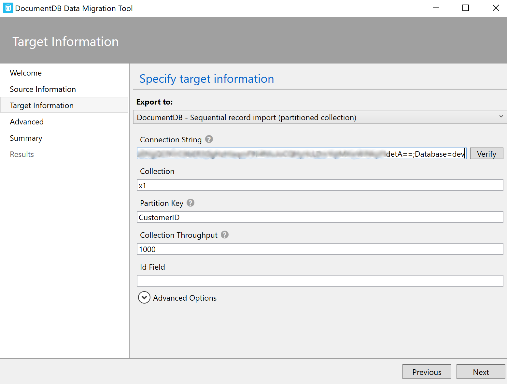
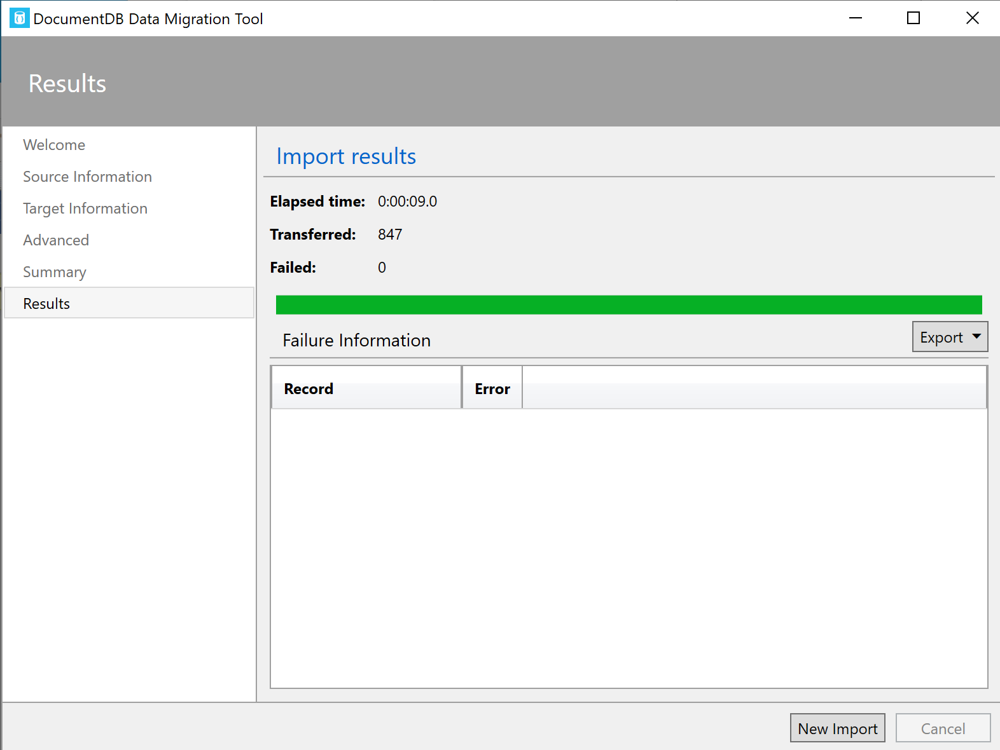
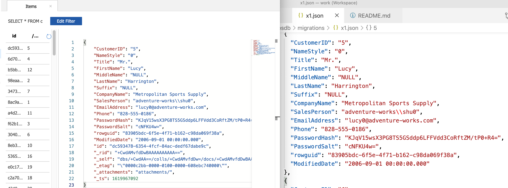

# Migrations - Miscellaneous Notes

- [Data Migration Tool](https://docs.microsoft.com/en-us/azure/cosmos-db/import-dat)
- ADF: https://docs.microsoft.com/en-us/azure/data-factory/connector-azure-cosmos-db
- ADF: https://docs.microsoft.com/en-us/azure/data-factory/connector-azure-cosmos-db#import-and-export-json-documents

## Azure Data Studio

Create a **Notebook** in Azure Data Studio (see red highlight).

---

Execute a SQL query and export the data to a JSON file (see red highlight).

---

See the exported JSON file:

File x1.json is an array of 847 documents.

## Data Migration Tool

- https://docs.microsoft.com/en-us/azure/cosmos-db/import-data

Choose the above **x1.json** file as the Source of the Migration, and
setup your Azure CosmosDB as the target of the migration, as shown here.
Use your CosmosDB connection string, and append "Database=xxx", where xxx 
is your database name.

---

847 documents imported, as expected:

---

Side-by-Side comparison of the same document in CosmosDB (left) and in the 
x1.json file (right).

