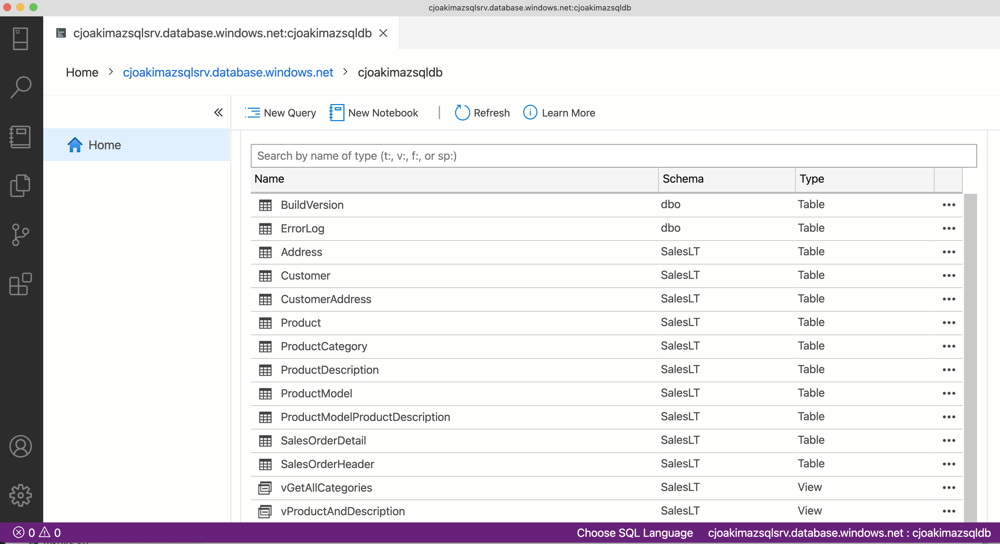
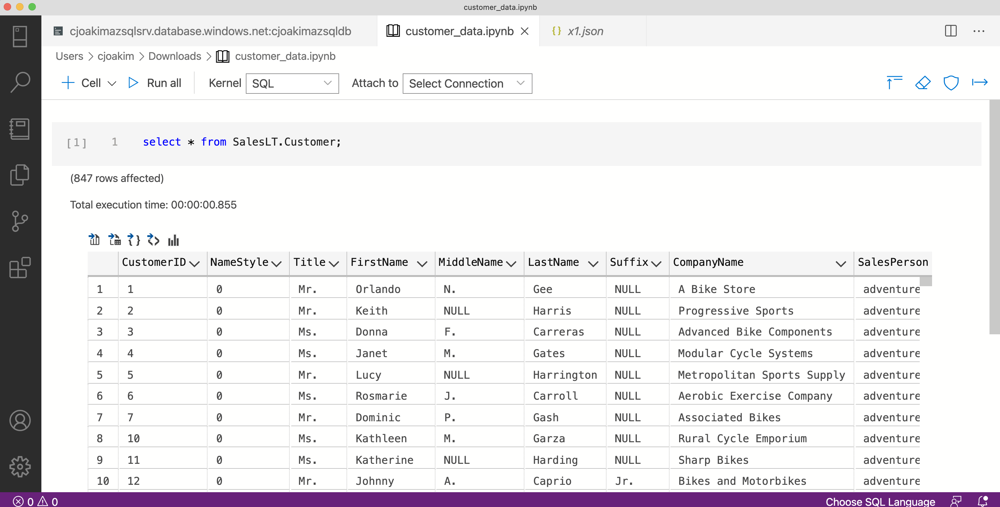
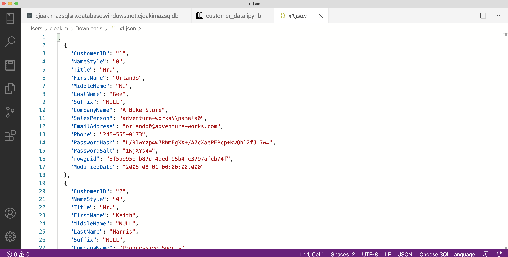

# Migrations - Miscellaneous Notes

- [Data Migration Tool](https://docs.microsoft.com/en-us/azure/cosmos-db/import-dat)
- ADF: https://docs.microsoft.com/en-us/azure/data-factory/connector-azure-cosmos-db
- ADF: https://docs.microsoft.com/en-us/azure/data-factory/connector-azure-cosmos-db#import-and-export-json-documents

## Azure Data Studio

Create a **Notebook** in Azure Data Studio (see red highlight).

---

Execute a SQL query and export the data to a JSON file (see red highlight).

---

See the exported JSON file:

## Data Migration Tool

