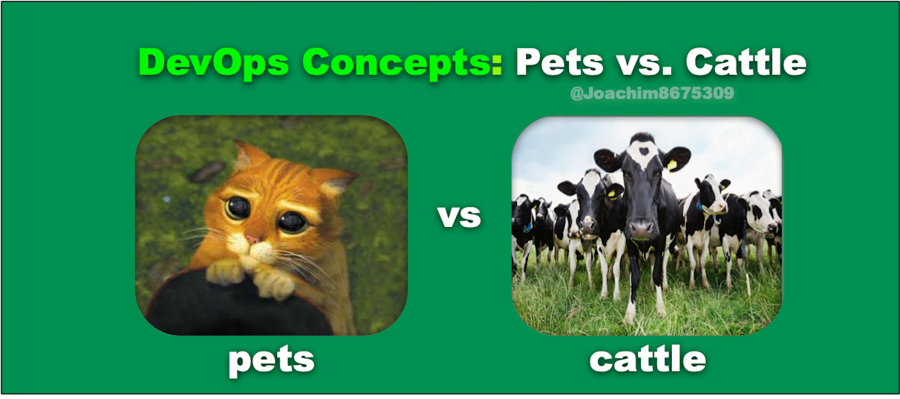

# 1.01 - Azure


## IaaS

**Infrastructure-as-a-Service** 

- Servers, Storage, and Networking
- Low-level 
- Burden is on the Customer to deploy, patch, integrate, secure, scale

See https://azure.microsoft.com/en-us/overview/what-is-azure/iaas/

---

## PaaS

**Platform-as-a-Service** 

- Completely Managed by the Cloud Provider
- Serverless
- Scalable
- **CosmosDB is PaaS**

See https://azure.microsoft.com/en-us/overview/what-is-paas/

---

## Advantages

- On-demand scalability
- No on-site hardware required
- Cost-effective subscription model
- High availability
- Enterprise-level development tools
- World-class cybersecurity
- Advanced compliance features

See https://www.actsolution.net/blog/what-are-the-business-benefits-of-microsoft-azure-cloud/

--

## Hierarchy

Azure uses this hierarchy for cost and RBAC isolation.

```
Enterprise Agreement
    Subscription 1
        Resource Group 1
           ...resources.
           ...CosmosDB
        Resource Group 2
           ...resources.
        Resource Group n
           ...resources.

    Subscription n
        Resource Group 1
           ...resources.
        Resource Group 2
           ...resources.
        Resource Group n
           ...resources.
           ...another CosmosDB
           ...another CosmosDB
```

See https://docs.microsoft.com/en-us/azure/cloud-adoption-framework/decision-guides/subscriptions/

---

## Pets vs Cattle

<p align="center"></p>

Pets are your on-prem servers you've know for years.  Lots of care-and-feeding.

Cattle are IaaS resources and PaaS services you can quickly consume and dispose of.

See http://cloudscaling.com/blog/cloud-computing/the-history-of-pets-vs-cattle/

---

## Provisioning

- Manually in the Azure Portal Web UI (https://portal.azure.com/)
- [Azure PowerShell cmdlets](https://docs.microsoft.com/en-us/powershell/azure/?view=azps-6.1.0)
- [az CLI](https://docs.microsoft.com/en-us/cli/azure/install-azure-cli)
- [Azure Resource Manager (ARM) Templates](https://docs.microsoft.com/en-us/azure/azure-resource-manager/templates/overview)
- [Bicep](https://docs.microsoft.com/en-us/azure/azure-resource-manager/bicep/overview)
- Azure Programming Language SDKs (DotNet, Java, Python, Node.js, etc.)
- [Terraform](https://docs.microsoft.com/en-us/azure/developer/terraform/overview)

See https://docs.microsoft.com/en-us/azure/developer/python/cloud-development-provisioning

---

## DevOps

> DevOps is a set of practices that combines software development (Dev) and IT operations (Ops).
> It aims to shorten the systems development life cycle and provide continuous delivery with high software quality.
> DevOps is complementary with Agile software development; several DevOps aspects came from the Agile methodology.

- [Wikipedia](https://en.wikipedia.org/wiki/DevOps)
- [Azure DevOps](https://azure.microsoft.com/en-us/services/devops/)

---

## Security & Compliance

- https://azure.microsoft.com/en-us/overview/trusted-cloud/compliance/
- https://docs.microsoft.com/en-us/azure/compliance/
- [ATP](https://techcommunity.microsoft.com/t5/security-compliance-and-identity/introducing-azure-advanced-threat-protection/ba-p/250332)

---

## Marketplace

> Search from a rich catalog of more than 17,000 certified apps and services, deploy seamlessly, and simplify billing with a single bill for all Microsoft and third-party solutions.

See Azure Portal.

See https://azure.microsoft.com/en-us/marketplace/

---

[toc](June_2021.md) &nbsp; |  &nbsp; [previous](June_2021.md) &nbsp; | &nbsp; [next](1_02_nosql.md) &nbsp;
