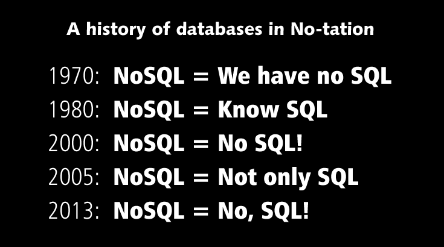
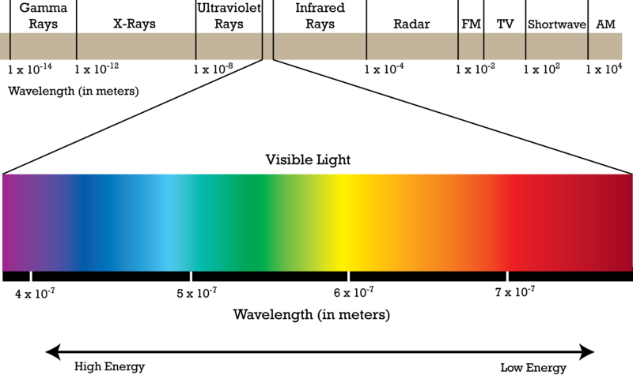
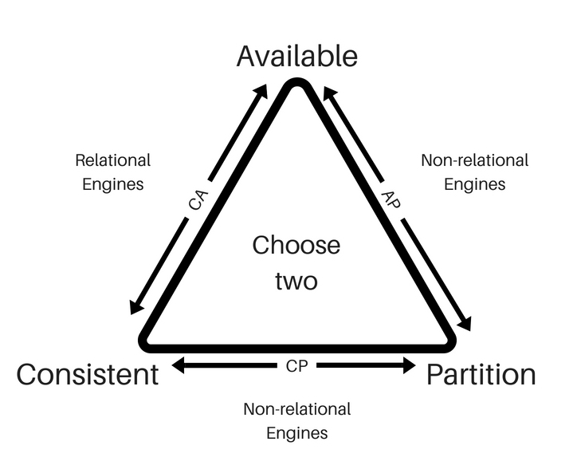

# 1.02 - NoSQL

## History of NoSQL

---

## Definition

> A NoSQL (originally referring to "non-SQL" or "non-relational") database provides a mechanism for storage and retrieval of data that is modeled in means other than the tabular relations used in relational databases(1).

See https://en.wikipedia.org/wiki/NoSQL

(1) = my footnote, after 1990 and Dr. E.F. Codd

Others models pre-dated Relational, such as **hierarchical** [IMS](https://www.ibm.com/it-infrastructure/z/ims)

---

## Spectrum

Think of relational databases as the narrow (i.e. - **ANSI SQL standard**) but dense band of wavelengths that is visible light.

**NoSQL is all the other wavelengths; there is tremendous variety**.

## Example NoSQL Databases/Datastores

- [Redis](https://redis.io/)
- [Apache HBase](https://hbase.apache.org/)
- [Apache Cassandra](https://cassandra.apache.org/)
- [Apache CouchDB](https://couchdb.apache.org/)
- [Apache TinkerPop / Gremlin](https://tinkerpop.apache.org/)
- [MongoDB](https://www.mongodb.com/)
- [CosmosDB](https://azure.microsoft.com/en-us/services/cosmos-db/)
- ...many more...

---

## CAP Theorem

> In theoretical computer science, the CAP theorem, also named Brewer's theorem after computer scientist Eric Brewer,
> states that it is impossible for a distributed data store to simultaneously provide more than two out of the following
> three guarantees:
> 1) Consistency: Every read receives the most recent write or an error
> 2) Availability: Every request receives a (non-error) response, without the guarantee that it contains the most recent write
> 3) Partition tolerance: The system continues to operate despite an arbitrary number of messages being dropped (or delayed) by the network between nodes

See https://en.wikipedia.org/wiki/CAP_theorem

---

## Why use NoSQL?

- Size of data; horizontally distributed
- Speed of throughput; capable of millions of operations per second
- Development Speed and Agility.  Schemaless
- End-to-End JSON applications, reduce transformations, increase speed
- High Availability.  Your data is stored on multiple nodes
- Storage is relatively very inexpensive now, vs 1970.  3NF not necessary.
- New types of applications, such as IoT, Social Networks, Graph

---

## What NoSQL Isn't

---

[toc](0_table_of_contents.md) &nbsp; |  &nbsp; [previous](1_01_azure.md) &nbsp; | &nbsp; [next](0_table_of_contents.md) &nbsp;
