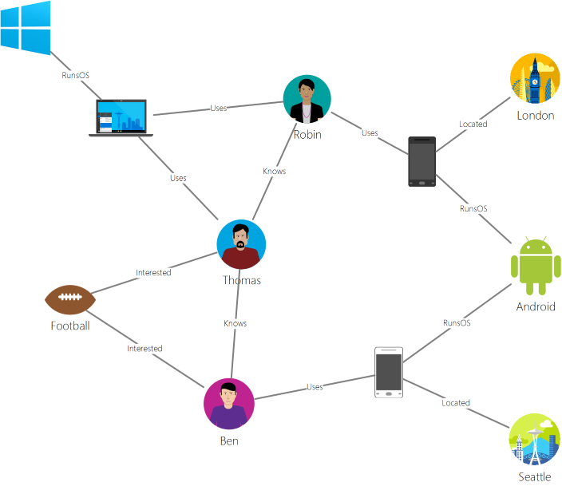

# 2.01 - CosmosDB APIs


## A Family of NOSQL Databases

<p align="center"></p>

#### Common Foundation

- Compute, Storage, Request Units, Monitoring, etc.
- But implements several **wire protocols**, one per **API** type
- **An individual CosmosDB Account is just one of the above APIs** (not all)
- Edge Case: Gremlin and SQL APIs in a Gremlin account

---

### Links:

- [Intro](https://docs.microsoft.com/en-us/azure/cosmos-db/introduction)
- [Documentation](https://docs.microsoft.com/en-us/azure/cosmos-db/)
- [NoSQL vs Relational](https://docs.microsoft.com/en-us/azure/cosmos-db/relational-nosql)
- [Learning Path](https://docs.microsoft.com/en-us/learn/paths/work-with-nosql-data-in-azure-cosmos-db/)

---

## SQL API (Document)

- https://docs.microsoft.com/en-us/azure/cosmos-db/create-cosmosdb-resources-portal
- [SQL Queries](https://docs.microsoft.com/en-us/azure/cosmos-db/sql-query-getting-started)

#### Sample Document (JSON)

```
{
  "id": "AndersenFamily",
  "lastName": "Andersen",
  "parents": [
     { "firstName": "Thomas" },
     { "firstName": "Mary Kay"}
  ],
  "children": [
     {
         "firstName": "Henriette Thaulow",
         "gender": "female",
         "grade": 5,
         "pets": [{ "givenName": "Fluffy" }]
     }
  ],
  "address": { "state": "WA", "county": "King", "city": "Seattle" },
  "creationDate": 1431620472,
  "isRegistered": true
}
```

#### Sample Queries 

```
SELECT *
FROM Families f
WHERE f.id = "AndersenFamily"
```

```
SELECT COUNT(1)
FROM c
```

---

## Mongo API

- https://docs.microsoft.com/en-us/azure/cosmos-db/mongodb-introduction
- https://www.mongodb.com/

#### Sample Document (JSON)

```
{
	"_id" : ObjectId("60c7a79dd1f7c4fc858b5456"),
	"airport_id" : "5841",
	"name" : "Captain Ramon Xatruch Airport",
	"city" : "La Palma",
	"country" : "Panama",
	"iata_code" : "PLP",
	"icao_code" : "MPLP",
	"latitude" : "8.406669616699219",
	"longitude" : "-78.1417007446289",
	"altitude" : "30",
	"timezone_num" : "-5",
	"dst" : "U",
	"timezone_code" : "America/Panama",
	"type" : "airport",
	"source" : "OurAirports",
	"pk" : "Captain Ramon Xatruch Airport"
}
```

---

## Gremlin/Graph API

- https://docs.microsoft.com/en-us/azure/cosmos-db/graph-introduction
- https://tinkerpop.apache.org/

### Concepts

- Vertices
- Edges
- Properties
- Traversal

<p align="center"></p>

---

## Cassandra API

- https://docs.microsoft.com/en-us/azure/cosmos-db/cassandra-introduction
- https://cassandra.apache.org/
- [CQL](https://cassandra.apache.org/doc/latest/cql/index.html)

### Concepts

- Ring, Masterless
- Keyspace
- Table
- Row Key / Primary Key / Composite Key / Clusterung Column
- Columns are Key-Value pairs, variable, "wide-column"
- CQL - Cassandra Query Language

<p align="center"></p>

---

## Table API

- https://docs.microsoft.com/en-us/azure/cosmos-db/table-introduction
- https://docs.microsoft.com/en-us/azure/cosmos-db/create-table-dotnet

### Concepts

- Tables/Entities
- Properties
- Query with OData, or Linq

<p align="center"></p>


---

[toc](0_table_of_contents.md) &nbsp; |  &nbsp; [previous](0_table_of_contents.md) &nbsp; | &nbsp; [next](2_02_cost_model.md) &nbsp;
