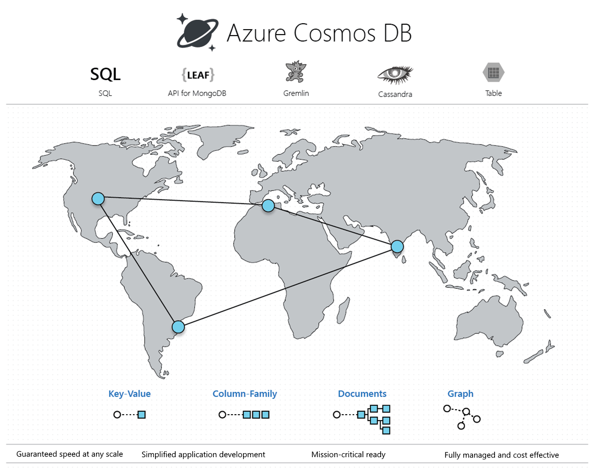

# 2.01 - CosmosDB APIs

## A Family of NOSQL Databases

<p align="center"></p>

#### CosmosDB Common Foundation

- Compute, Storage, Request Units, Monitoring, etc.
- But implements several **wire protocols**, one per **API** type
- **An individual CosmosDB Account is just one of the above APIs** (not all)
- Edge Case: Gremlin and SQL APIs in a Gremlin account

---

### Links:

- [Intro](https://docs.microsoft.com/en-us/azure/cosmos-db/introduction)
- [Documentation](https://docs.microsoft.com/en-us/azure/cosmos-db/)
- [NoSQL vs Relational](https://docs.microsoft.com/en-us/azure/cosmos-db/relational-nosql)
- [Learning Path](https://docs.microsoft.com/en-us/learn/paths/work-with-nosql-data-in-azure-cosmos-db/)

---

## Learning and Growth Mindset

<p align="center"></p>

---

## SQL API (Document)

- https://docs.microsoft.com/en-us/azure/cosmos-db/create-cosmosdb-resources-portal
- [SQL Queries](https://docs.microsoft.com/en-us/azure/cosmos-db/sql-query-getting-started)

#### Sample Document (JSON)

```
{
   "altitude": "748",
   "city": "Charlotte",
   "country": "United States",
   "iata_code": "CLT",
   "id": "4b98b172-2e9e-11ea-a7b6-7fc29890ecb3",
   "latitude": "35.214",
   "location": {
      "coordinates": [
            -80.943139,
            35.214
      ],
      "type": "Point"
   },
   "longitude": "-80.943139",
   "name": "Charlotte Douglas Intl",
   "pk": "CLT",
   "timezone_code": "America/New_York",
   "timezone_num": "-5",
   "_rid": "LK8RAJxYN85mAQAAAAAAAA==",
   "_self": "dbs/LK8RAA==/colls/LK8RAJxYN84=/docs/LK8RAJxYN85mAQAAAAAAAA==/",
   "_etag": "\"0e028935-0000-0100-0000-60ccf8090000\"",
   "_attachments": "attachments/",
   "_ts": 1624045577
}
```

Note the **several system-generated underscored attributes** - such as **_ts**, and **_etag**

#### Sample Queries

```
SELECT * FROM c where c.pk = 'CLT'
```

```
SELECT COUNT(1) FROM c
```

---

## Mongo API

- https://docs.microsoft.com/en-us/azure/cosmos-db/mongodb-introduction
- https://www.mongodb.com/

#### JSON Query Syntax

```
db.games.find({"name": "Allyson Michelle Felix"}).limit(1)
```

#### Sample Document (JSON)

```
{ 
    "_id" : ObjectId("60c7a7f55a32afd5a4c4245c"), 
    "name" : "Allyson Michelle Felix", 
    "sex" : "f", 
    "age" : "26", 
    "height" : "168.0", 
    "weight" : "56.0", 
    "team" : "united states", 
    "noc" : "usa", 
    "games" : "2012_summer", 
    "year" : "2012", 
    "season" : "summer", 
    "city" : "london", 
    "sport" : "athletics", 
    "event" : "athletics womens 100 metres", 
    "medal" : "", 
    "medal_value" : "0", 
    "pk" : "2012_summer", 
    "doctype" : "2012_summer", 
}
```

---

## Gremlin/Graph API

- https://docs.microsoft.com/en-us/azure/cosmos-db/graph-introduction
- https://tinkerpop.apache.org/

### Concepts

- Vertices
- Edges
- Properties
- Traversal

<p align="center"></p>

---

## Cassandra API

- https://docs.microsoft.com/en-us/azure/cosmos-db/cassandra-introduction
- https://cassandra.apache.org/

### Concepts

- Ring, Masterless
- Keyspace
- Table
- Row Key / Primary Key / Composite Key / Clusterung Column
- Columns are Key-Value pairs, variable, "wide-column"
- [CQL, Cassandra Query Language](https://cassandra.apache.org/doc/latest/cql/index.html)


<p align="center"></p>

---

## Table API

- https://docs.microsoft.com/en-us/azure/cosmos-db/table-introduction
- https://docs.microsoft.com/en-us/azure/cosmos-db/create-table-dotnet

### Concepts

- Tables/Entities
- Properties
- Query with OData, or Linq

<p align="center"></p>


---

[toc](0_table_of_contents.md) &nbsp; |  &nbsp; [previous](0_table_of_contents.md) &nbsp; | &nbsp; [next](2_02_cost_model.md) &nbsp;
