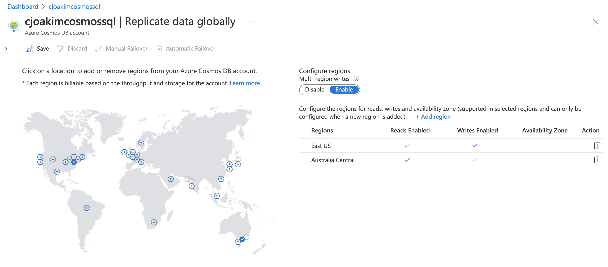
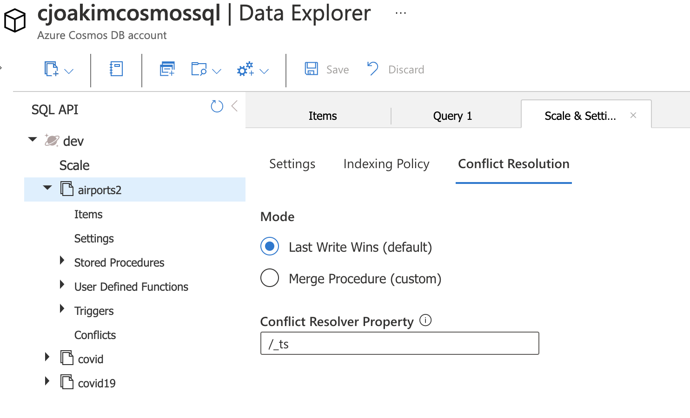

# 3.05 - Multi-Region

You can choose to replicate your CosmosDB account across 2 or more regions.

- 99.99% guaranteed uptime with single-region deployment
- 99.999% guaranteed uptime with multi-region deployment
- **Replication is Automatic**
- Enables High Availability
- Enables your data to be locally accessed by your app and customers; reduces latency   
- Single-master or Multi-Master
- There is an egress charge
- You can simulate a regional outage to test business continuity

See https://docs.microsoft.com/en-us/azure/cosmos-db/distribute-data-globally

<p align="center"></p>

---

## Deployment Example

<p align="center"></p>

---

## Consistency Levels

These define how your data is replicated

### The Five Levels

- Strong
- Bounded staleness
- Session  (the default, read your own writes)
- Consistent prefix
- Eventual

### Default and Overrides

- Each Azure Cosmos **account has a default consistency level**
- The default consistency level **can be overridden** on a per-operation basis

### Conflict Resolution

- Last Write Wins (LWW), or Custom
- https://docs.microsoft.com/en-us/azure/cosmos-db/conflict-resolution-policies

<p align="center"></p>

## Configuration in Azure Portal 

<p align="center"></p>

#### DotNet example

```
// Override consistency at the SDK client level (to Eventual)

documentClient = new DocumentClient(
    new Uri(endpoint), authKey, connectionPolicy, ConsistencyLevel.Eventual);

// Furthermore, you can override consistency at the Request level via request options

RequestOptions requestOptions = new RequestOptions {
    ConsistencyLevel = ConsistencyLevel.Eventual };

var response = await client.CreateDocumentAsync(
    collectionUri, document, requestOptions);
```

---

## Set Preferred Locations with SDKs

The list of preferred locations is usually configured with **environment variables**
in your regionally-deployed services, and these values are read by your application
code, rather than the hard-coding you see below.

### DotNet

```
// Getting endpoints from application settings or other configuration location

Uri accountEndPoint = new Uri(Properties.Settings.Default.GlobalDatabaseUri);
string accountKey = Properties.Settings.Default.GlobalDatabaseKey;
  
ConnectionPolicy connectionPolicy = new ConnectionPolicy();

// Setting read region selection preference
connectionPolicy.PreferredLocations.Add(LocationNames.WestUS);      // first preference
connectionPolicy.PreferredLocations.Add(LocationNames.EastUS);      // second preference
connectionPolicy.PreferredLocations.Add(LocationNames.NorthEurope); // third preference

// Initialize connection
DocumentClient docClient = new DocumentClient(
    accountEndPoint,
    accountKey,
    connectionPolicy);

// Connect to DocDB
await docClient.OpenAsync().ConfigureAwait(false);
```

### Java

```
ArrayList<String> preferredRegions = new ArrayList<String>();
preferredRegions.add("WestUS");
preferredRegions.add("EastUS");
preferredRegions.add("NorthEurope");

CosmosAsyncClient client =
        new CosmosClientBuilder()
                .endpoint(HOST)
                .key(MASTER_KEY)
                .multipleWriteRegionsEnabled(true)
                .preferredRegions(preferredRegions)
                .buildAsyncClient();
```

## Links

- https://docs.microsoft.com/en-us/azure/cosmos-db/how-to-multi-master?tabs=api-async
- [Mark Brown Global Distribution Demo](https://github.com/markjbrown/cosmos-global-distribution-demos)

---

[toc](0_table_of_contents.md) &nbsp; |  &nbsp; [previous](3_04_request_units.md) &nbsp; | &nbsp; [next](3_06_sql.md) &nbsp;
