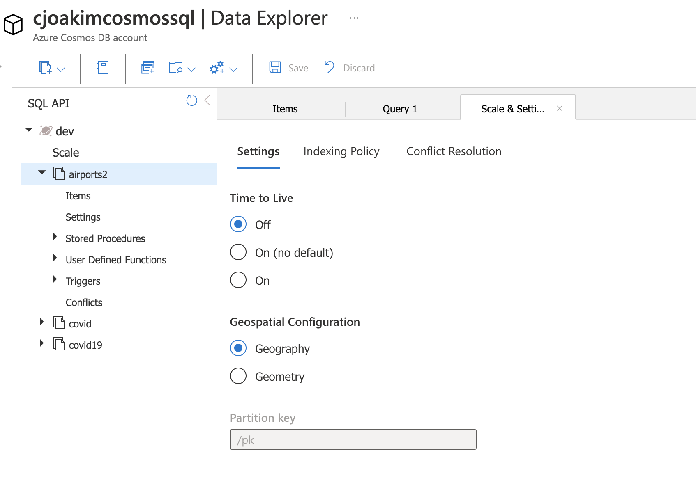

# 3.09 - TTL


See https://docs.microsoft.com/en-us/azure/cosmos-db/time-to-live

## Benefits of Time-to-Live (TTL)

- **Provides the ability to delete items automatically from a container after a certain time period**
  - So **you don't have to incur the costs of identifying, then deleting, old documents**
- Provides the ability to override the default TTL on a per-item basis
- TTL is set in terms of **seconds** (i.e. - 604,800 equals one week)
- Defaults to -1, or no expiration
- TTL applies to the system-generated **__ts** value; **the insert or last update epoch timestamp**

## Configuration in Azure Portal 

<p align="center"></p>

## Example

```
{
 "id": "1",
 "_rid": "Jic9ANWdO-EFAAAAAAAAAA==",
 "_self": "dbs/Jic9AA==/colls/Jic9ANWdO-E=/docs/Jic9ANWdO-EFAAAAAAAAAA==/",
 "_etag": "\"0d00b23f-0000-0000-0000-5c7712e80000\"",
 "_attachments": "attachments/",
 "_ts": 1551307486,    <-- last modification time
  "ttl": 10            <-- ttl is 10, so expires at 1551307496
}
```

## Set Container Default TTL

### DotNet

```
// Create a new container with TTL enabled and a 90 day expiration

await client.GetDatabase("dev").CreateContainerAsync(
    new ContainerProperties
    {
        Id = "airports",
        PartitionKeyPath = "/pk",
        DefaultTimeToLive = 60 * 60 * 24 * 7  // expire after one week
    });
```

```
// Include a property that serializes to "ttl" in JSON

public class SalesOrder
{
    [JsonProperty(PropertyName = "id")]
    public string Id { get; set; }
    
    [JsonProperty(PropertyName="cid")]
    public string CustomerId { get; set; }

    // used to set expiration policy
    [JsonProperty(PropertyName = "ttl", NullValueHandling = NullValueHandling.Ignore)]
    public int? ttl { get; set; }   // <-- value is optional

    //...
}

// Set the value to the expiration in seconds

SalesOrder salesOrder = new SalesOrder
{
    Id = "SO05",
    CustomerId = "CO18009186470",
    ttl = 60 * 60 * 24 * 7;
};
```

### Java

```
CosmosAsyncContainer container = null;

// Create a new container with TTL enabled with default expiration value
CosmosContainerProperties containerProperties = 
    new CosmosContainerProperties("airports", "/pk");

containerProperties.setDefaultTimeToLiveInSeconds(60 * 60 * 24 * 7);

container = database.createContainerIfNotExists(
    containerProperties, 400).block().getContainer();
```

## Synapse Link

With Synapse Link, you can specify the TTL times of **both** the CosmosDB data and the Synapse Link data

---

[toc](0_table_of_contents.md) &nbsp; |  &nbsp; [previous](3_08_change_feed.md) &nbsp; | &nbsp; [next](3_10_spatial_support.md) &nbsp;
