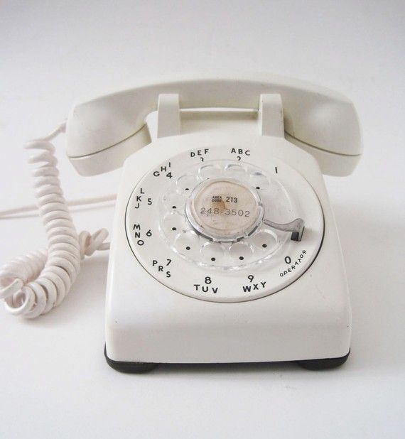
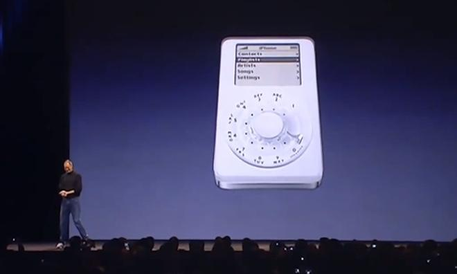

# 4.03 - Relational-to-Cosmos Example

## Standard Telephone Design 1960-2006

---

## iPhone

What does the future look like?

---

## Retail Examples

---

## Adventureworks

- https://github.com/cjoakim/azure-adventureworks-to-cosmos

[toc](June_2021.md) &nbsp; |  &nbsp; [previous](4_02_design_considerations.md) &nbsp; | &nbsp; [next](4_04_local_development.md) &nbsp;
