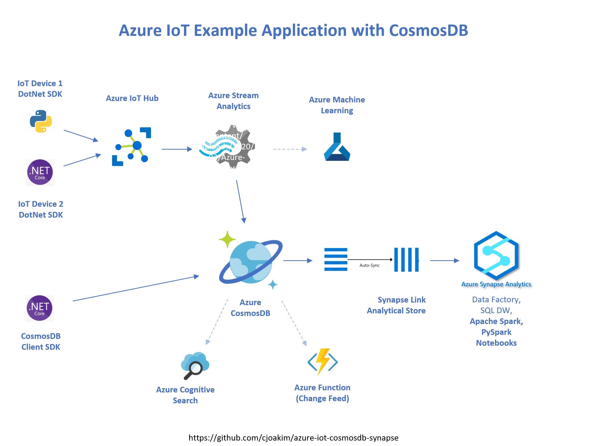
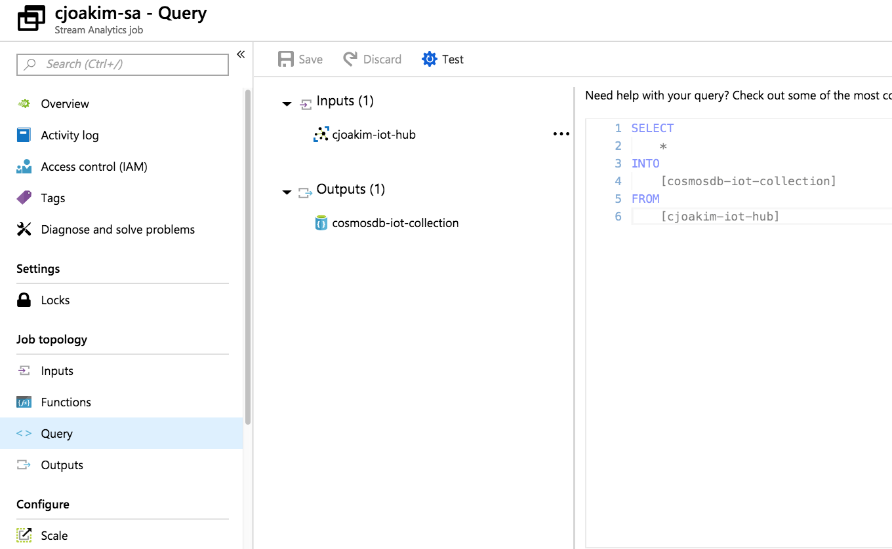

# 5.01 - Azure Stream Analytics

## Features

- Scalable PaaS service
- Process high volumes of fast streaming data
- Optionally integrate with Azure Machine Learning for Anomoly Detection
- Ingests data from:
  - Azure Event Hub
  - Azure Event Hub with Apache Kafka API
  - Azure IoT Hub
  - Azure Blob Storage
- Easy to use SQL Syntax.  JavaScript and C# also

## Links

- https://docs.microsoft.com/en-us/azure/stream-analytics/stream-analytics-introduction

## Example IoT Architecture

---

## Example Stream Analytics Job

---

[toc](0_table_of_contents.md) &nbsp; |  &nbsp; [previous](0_table_of_contents.md) &nbsp; | &nbsp; [next](5_02_azure_functions.md) &nbsp;
