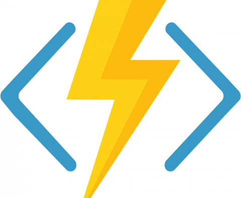

# 5.02 - Azure Functions

**Event-driven Serverless Compute**

## Features

- PaaS Service
- Serverless
- Scalable
- EventDriven
- [Multiple Programming Languages](https://docs.microsoft.com/en-us/azure/azure-functions/supported-languages)
- [Can be Deployed as a Docker Container](https://docs.microsoft.com/en-us/azure/azure-functions/functions-create-function-linux-custom-image?tabs=bash%2Cportal&pivots=programming-language-csharp)

## Links

- https://azure.microsoft.com/en-us/services/functions/
- https://docs.microsoft.com/en-us/azure/cosmos-db/change-feed-functions
- https://docs.microsoft.com/en-us/azure/azure-functions/functions-bindings-cosmosdb-v2-trigger
- https://docs.microsoft.com/en-us/azure/azure-functions/supported-languages

---

## CosmosDB use-case: Change Feed

---

### Notes

- **Event-Driven** is a better/faster/cheaper design than **Polling**
- Uses a **Leases** container with the Change Feed
  - Pointer to current read stream state
  - Thus consumes some RUs
- One Function reads the change feed for **one CosmosDB collection** (not a database)
- The Function can be **Triggered** by each event, or in microbatches
- The Function can run in an **App Service** for scaling
- Configure both CosmosDB and AppService to log to **Azure Monitor/Log Analytics**

---

[toc](0_table_of_contents.md) &nbsp; |  &nbsp; [previous](5_01_azure_stream_analytics.md) &nbsp; | &nbsp; [next](5_03_synapse_link.md) &nbsp;
