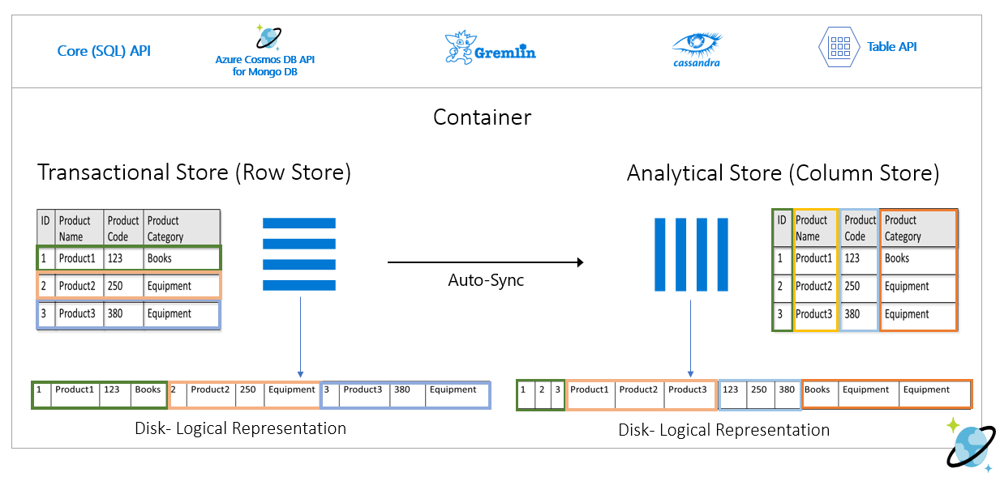
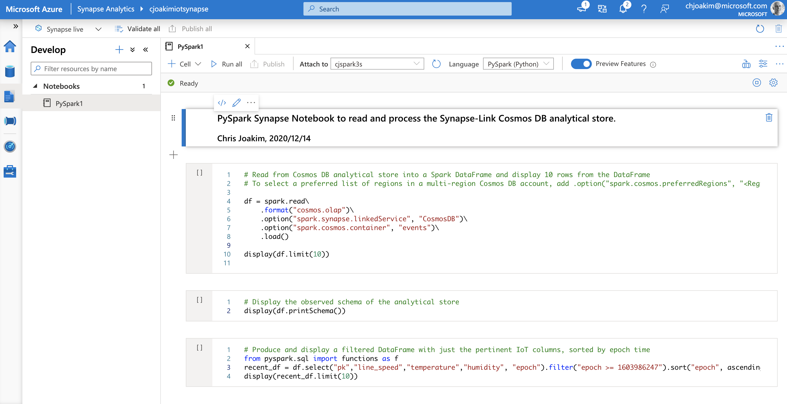

# 5.03 - Synapse Link

## Features

- **Free, Automatic, Fast ETL from CosmosDB to Synapse**
- **Low Cost Analytical Storage**
- **"Parquet-like" format - Readable as a PySpark Dataframe**
- **Readable with T-SQL** (SQL DW)
- **TTL - both CosmosDB and Analytical Storage**
- Currently supported by the CosmosDB SQL and Mongo APIs

## Synapse and Synapse Link

<p align="center"></p>

## Azure Cosmos DB Analytical Data Store

See https://docs.microsoft.com/en-us/azure/cosmos-db/analytical-store-introduction

<p align="center"></p>

---

## PySpark Notebook in Synapse

<p align="center"></p>

```
# Read from Cosmos DB analytical store into a Spark DataFrame and display 10 rows from the DataFrame

df = spark.read\
    .format("cosmos.olap")\
    .option("spark.synapse.linkedService", "cosmos_dev_db")\
    .option("spark.cosmos.container", "plants")\
    .load()

display(df.limit(10))
```

---

## Links

- https://docs.microsoft.com/en-us/azure/cosmos-db/synapse-link
- https://docs.microsoft.com/en-us/azure/synapse-analytics/sql/overview-features
- [IoT Example](https://github.com/cjoakim/azure-iot-cosmosdb-synapse)


[toc](0_table_of_contents.md) &nbsp; |  &nbsp; [previous](5_02_azure_functions.md) &nbsp; | &nbsp; [next](5_04_azure_search.md) &nbsp;
