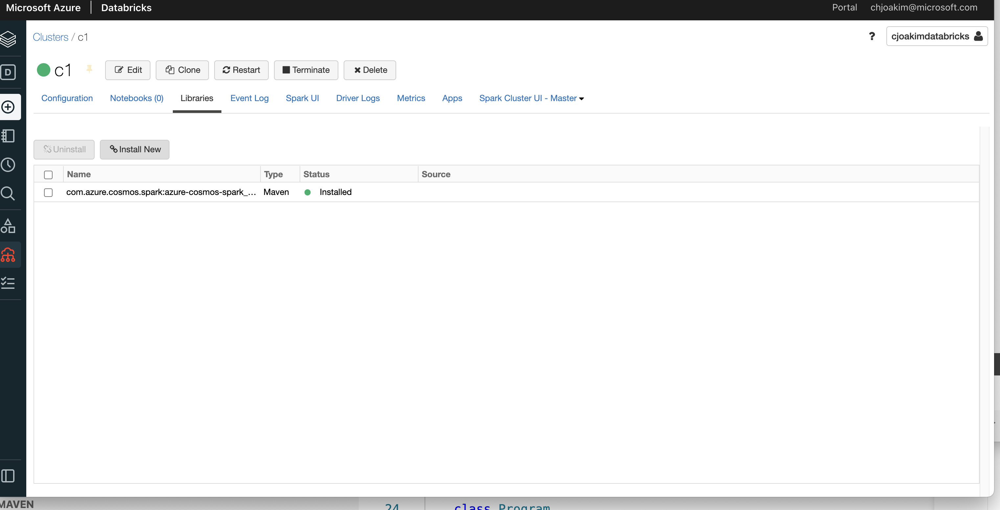

# 5.05 - Azure Databricks

## Links

- https://docs.microsoft.com/en-us/azure/databricks/scenarios/what-is-azure-databricks
- https://devblogs.microsoft.com/cosmosdb/spark-3-connector-databricks

## Example

### Add the Java Library to your Databricks Cluster

<p align="center"></p>

---

<p align="center"></p>

---

### PySpark Notebook

```
# See https://devblogs.microsoft.com/cosmosdb/spark-3-connector-databricks/
# Each of the following "COMMAND ----------" is a Notebook cell.
# Chris Joakim, Microsoft, June 2021


# Databricks notebook source
# Read the Databricks built-in dataset as a PySpark DataFrame
df = spark.read.format('csv').options(header='true').load('dbfs:/databricks-datasets/COVID/coronavirusdataset/SeoulFloating.csv')

# Display the observed schema, or structure of the DataFrame.
display(df.printSchema())


# COMMAND ----------

# Print the number of rows and columns in the DataFrame
print((df.count(), len(df.columns)))   # (1084800, 7)


# COMMAND ----------

# Print up to 10 rows of the DataFrame
display(df.limit(20))


# COMMAND ----------

# Set the CosmosDB Configuration and Credentials
cosmosEndpoint = "https://cjoakimcosmossql.documents.azure.com:443/"
cosmosMasterKey = "...your key..."
cosmosDatabaseName = "dev"
cosmosContainerName = "covid19"

spark.conf.set("spark.sql.catalog.cosmosCatalog", "com.azure.cosmos.spark.CosmosCatalog")
spark.conf.set("spark.sql.catalog.cosmosCatalog.spark.cosmos.accountEndpoint", cosmosEndpoint)
spark.conf.set("spark.sql.catalog.cosmosCatalog.spark.cosmos.accountKey", cosmosMasterKey)

# spark.sql("CREATE DATABASE IF NOT EXISTS cosmosCatalog.{};".format(cosmosDatabaseName))
# spark.sql("CREATE TABLE IF NOT EXISTS cosmosCatalog.{}.{} using cosmos.oltp TBLPROPERTIES(partitionKeyPath = '/city', manualThroughput = '1100')".format(cosmosDatabaseName, cosmosContainerName))

spark.sql("CREATE TABLE IF NOT EXISTS cosmosCatalog.{}.{} using cosmos.oltp TBLPROPERTIES(partitionKeyPath = '/city')".format(cosmosDatabaseName, cosmosContainerName))

# Set the write configuration
writeCfg = {
  "spark.cosmos.accountEndpoint": cosmosEndpoint,
  "spark.cosmos.accountKey": cosmosMasterKey,
  "spark.cosmos.database": cosmosDatabaseName,
  "spark.cosmos.container": cosmosContainerName,
  "spark.cosmos.write.strategy": "ItemOverwrite",
}

# Ingest the data
df.toDF("date","hour","birth_year","sex","province","city","id")\
   .write\
   .format("cosmos.oltp")\
   .options(**writeCfg)\
   .mode("APPEND")\
   .save()
```

---

[toc](0_table_of_contents.md) &nbsp; |  &nbsp; [previous](5_04_azure_search.md) &nbsp; | &nbsp; [next](5_06_applications.md) &nbsp;
