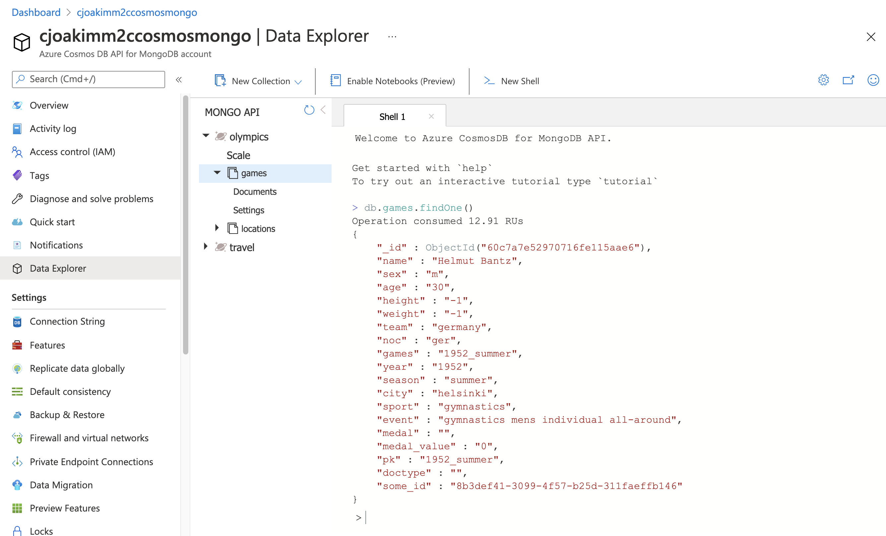
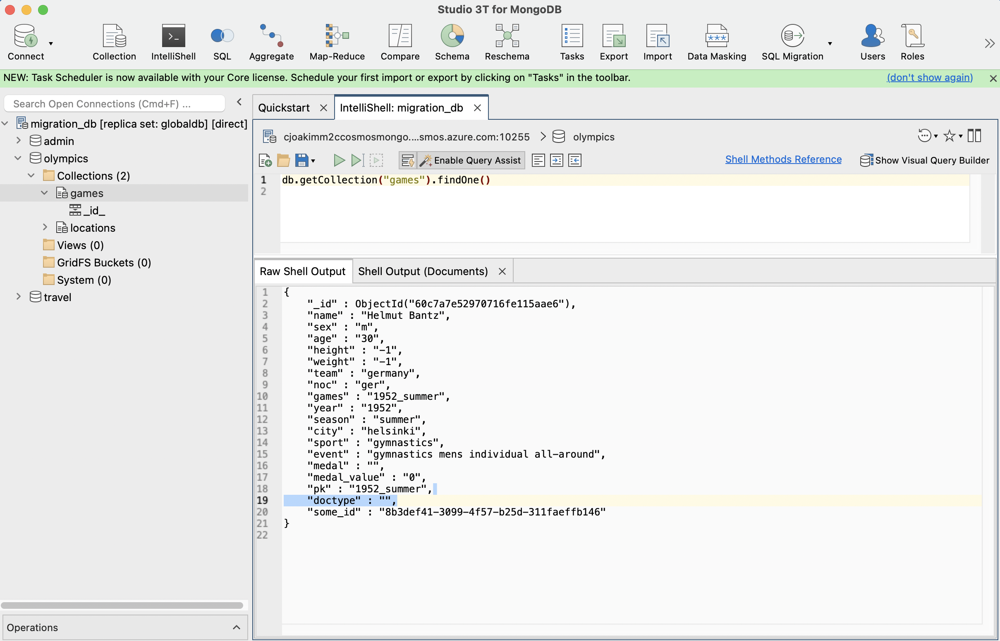

# 7.02 - MongoDB

## Links

- https://docs.microsoft.com/en-us/azure/cosmos-db/mongodb-introduction

## Features

- Mongo 4.0 API
- Works with mongo command-line tools: mongoexport, mongoimport, mongo shell, etc.
- Works with UI tools like [Studio 3T](https://studio3t.com/)
- "Just change your connection string"

#### Integrated Mongo Shell in Azure Portal

---

#### Works with your existing UI tools, like Studio 3T

---

## Mongo-to-CosmosDB Migration

- https://github.com/cjoakim/azure-m2c-wgm

---

## CosmosDB - Mongo 4.0 API

- [Feature Support](https://docs.microsoft.com/en-us/azure/cosmos-db/mongodb/feature-support-40)
- [Upgrade Process](https://docs.microsoft.com/en-us/azure/cosmos-db/mongodb/upgrade-mongodb-version)
- [Autoscale Databases, Containers](https://docs.microsoft.com/en-us/azure/cosmos-db/provision-throughput-autoscale)
- [Pricing/Capacity Calculator](https://cosmos.azure.com/capacitycalculator/)

---

[toc](0_table_of_contents.md) &nbsp; |  &nbsp; [previous](7_01_gremlin_graph.md) &nbsp; | &nbsp; [next](7_03_cassandra.md) &nbsp;
