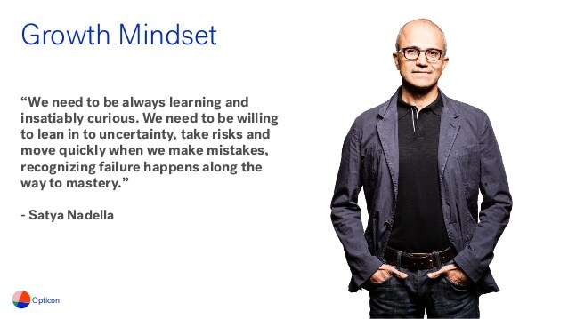
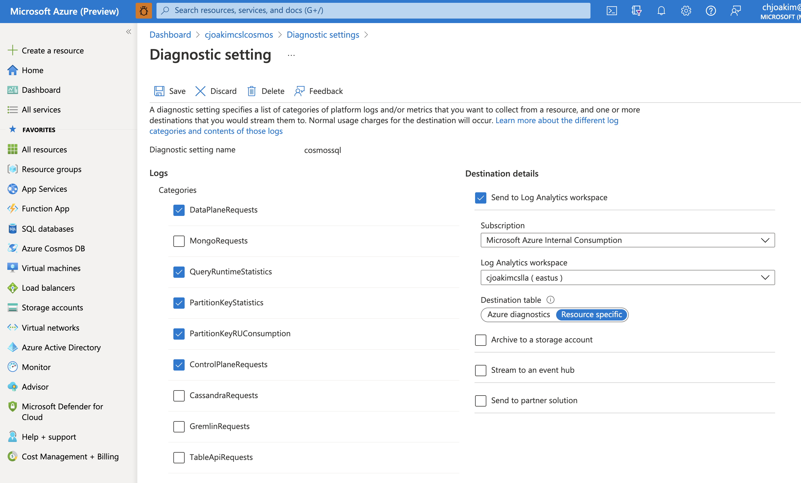

# 8.01 - Operational Best Practices 

## Growth Mindset

- Please read the CosmosDB documentation
- It's not just another database; definitely not relational
- Always be learning

<p align="center"></p>

---

## Partition Keys, Throughput, Limits, Design

### Partition Keys

#### Costs and Performance

- Choosing an appropriate **partition key is critical to performance and costs**
- You can't change the partition key attribute after the container has been created
- Use a **/pk** attribute to enable container evolution
- Strive to use the partition key in most of your queries 

#### Limits

- Be aware of the **20GB limit per Logical Partition**
  - A **Logical Partition** is all of the data for the documents with a given partition key value
  - You are responsible for the Logical Partitions
  - The CosmosDB PaaS service is responsible for creating and managing the Physical Partitions
  - See https://docs.microsoft.com/en-us/azure/cosmos-db/concepts-limits

### Throughput

- **Database-level Shared Throughput, and Autoscale**, is appropriate for most customers 
  - Specify a Maximum Request Units (RU) at the database level
  - CosmosDB will autoscale between 10% of that max to 100% of the max you specify
  - Up to 25 containers in the database share this throughput

- Physical Partitions can each support 10,000 RUs max
  - See https://docs.microsoft.com/en-us/azure/cosmos-db/concepts-limits

- https://docs.microsoft.com/en-us/azure/cosmos-db/set-throughput
- https://docs.microsoft.com/en-us/azure/cosmos-db/provision-throughput-autoscale

### Design 

- CosmosDB is **schemaless**; don't always create relational-like **"Entity Containers"**
- It's Ok and often appropriate to store dissimilar documents in the same container
  - Use a **doctype** or **type** attribute to distinguish these
- This enables efficient **Partition Key Joins**
- Store related (dissimilar) documents in the same partition key
  - Example: an eCommerce order, its line items, and delivery documents

#### Document Size

- Strive to use smaller documents (~1K); create write-only documents where possible
- Be aware of the cost to read and update **Jumbo Documents**

#### Indexing

- **Default wildcard indexing** works well for most customers
- But you can exclude from indexing the document attributes/paths not searched
- **Composite Indices** can greatly reduce query costs 
- Indexing can be updated at any time, unlike the partition key attibute

- https://docs.microsoft.com/en-us/azure/cosmos-db/index-policy
- https://devblogs.microsoft.com/cosmosdb/new-ways-to-use-composite-indexes/ (Tim Sander blog)

#### CosmosDB is not a DataLake

- Discuss Antipatterns

#### Batch Processing 

- Discuss sorting
- Discuss ETL **diff logic**

---

## Application Code

- Use the latest or recent SDKs.  **DotNet v3**, Java v4
- Use **Async** functionality for better application performance 
- Use preferred regions list in your SDK clients
- Use DotNet **dynamic** object functionality for reading dissimilar documents
  - Then cast to a specific class per the **doctype** attribute

- https://docs.microsoft.com/en-us/azure/cosmos-db/sql/sql-api-sdk-dotnet-standard
- https://docs.microsoft.com/en-us/azure/cosmos-db/sql/tutorial-global-distribution-sql-api?tabs=dotnetv3

---

## Use Azure Monitor

- Point your several PaaS services, including **CosmosDB** to an **Azure Monitor** instance
- Provides a single aggregated view of your application
- Also provides Alerting functionality
- https://docs.microsoft.com/en-us/azure/azure-monitor/overview 
- https://docs.microsoft.com/en-us/azure/cosmos-db/monitor-cosmos-db

### "Resource Specific" Destination Tables

- Enables faster and simpler Kusto queries
- Consumes less storage space

<p align="center"></p>

### Kusto Query Language

- https://docs.microsoft.com/en-us/azure/cosmos-db/cosmosdb-monitor-logs-basic-queries
- The Resource Specific CosmosDB tables begin with **CDB**, such as **CDBDataPlaneRequests**

#### Sample Kusto Queries

```
CDBDataPlaneRequests 
| where toint(DurationMs) > 3
| summarize count() by ClientIpAddress, TimeGenerated
```

How to get the logs for the partition keys whose storage size is greater than 8 GB?

```
CDBPartitionKeyStatistics
| where todouble(SizeKb) > 800000
```

#### In-Depth Examples

- https://docs.microsoft.com/en-us/azure/cosmos-db/cosmos-db-advanced-queries?tabs=resource-specific
- https://docs.microsoft.com/en-us/azure/cosmos-db/monitor-request-unit-usage
- https://docs.microsoft.com/en-us/azure/cosmos-db/monitor-server-side-latency

---

## Deploy to Multi-Regions with Auto Failover 

- Single write region for lower costs
- Use **Auto Failover** (not Manual)
- See https://docs.microsoft.com/en-us/azure/cosmos-db/high-availability

> The best configuration to achieve high availability in case of region outage
> is **single write region with service-managed failover**.

> It is strongly recommended that you configure the Azure Cosmos accounts used
> for production workloads to enable **automatic failover**. 

---

## Use Synapse Link for Analytics

- **HTAP - Hybrid Transactional and Analytical Processing** 
- Move expensive aggregration queries out of CosmosDB, into Synapse Analytics
- See example repo at: https://github.com/cjoakim/azure-cosmosdb-synapse-link 
- CosmosDB is not a DataLake (mentioned above)
