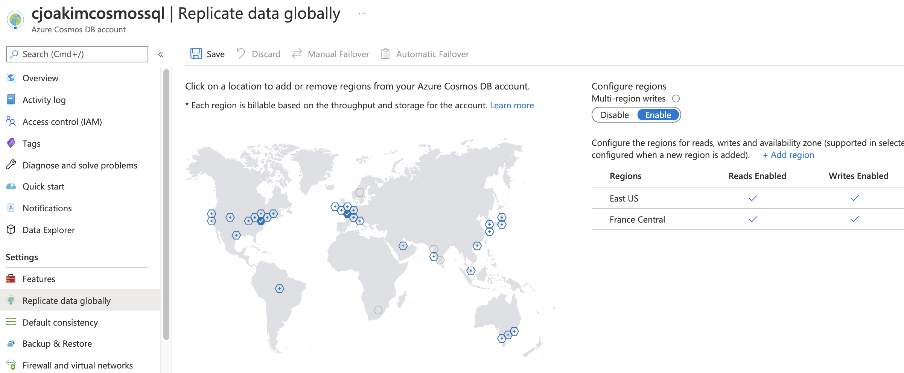

# CosmosDB MultiMaster

<p align="center"></p>

---

## Topics

- [Global Distribution, and Why?](https://docs.microsoft.com/en-us/azure/cosmos-db/distribute-data-globally)
  - Build highly available apps
  - Build highly responsive apps with low latency
  - [Configure Automatic Failover](https://docs.microsoft.com/en-us/azure/cosmos-db/how-to-manage-database-account#automatic-failover)
  - Choose from among 5 **Consistency Levels**

- [Consistency Levels](https://docs.microsoft.com/en-us/azure/cosmos-db/consistency-levels)
  - You can configure the **default consistency level** on your Azure Cosmos **account** at any time
  - The default consistency level can be overridden on individual operations via a SDK
  - The Five Levels
    - **Strong**
      - Data written to a quorum in all regions synchronously
      - The reads are guaranteed to return the most recent committed version of an item
      - the write latency is equal to two times round-trip time (RTT) between any of the two farthest regions, plus 10 milliseconds at the 99th percentile
      - Strong consistency for accounts with regions spanning more than 5000 miles is not enabled by default
    - **Bounded Staleness**
      - "staleness" can be configured in two ways (See Azure Portal UI)
        - The number of versions (K) of the item
        - The time interval (T) reads might lag behind the writes
    - **Session**
      - The default level
      - "read your own writes" within a single client session
    - **Consistent Prefix**
      - that reads never see out-of-order writes
      - If writes were performed in the order "A, B, C", then a client sees either "A", "A,B", or "A,B,C", but never out of order like "A,C" or "B,A,C". 
    - **Eventual**
      - no ordering guarantee for reads
      - the replicas within the group will eventually converge
      - still very fast, seconds per my observations

- [Conflict Resolution](https://docs.microsoft.com/en-us/azure/cosmos-db/global-dist-under-the-hood#conflict-resolution)
  - Last-Write-Wins (LWW), based on the system-generated **_ts** (timestamp) attribute
    - the item with the highest value for the conflict resolution path becomes the winner
  - [Custom Application-defined](https://docs.microsoft.com/en-us/azure/cosmos-db/how-to-manage-conflicts)

- SDKs for the Cosmos/SQL API
  - Interesting Functionality:
    - [Preferred Regions](https://docs.microsoft.com/en-us/azure/cosmos-db/tutorial-global-distribution-sql-api?tabs=dotnetv2%2Capi-async#preferred-locations)
    - [RetryOptions](https://docs.microsoft.com/en-us/dotnet/api/microsoft.azure.documents.client.connectionpolicy.retryoptions?view=azure-dotnet)
    - [Override the default consistency level](https://docs.microsoft.com/en-us/azure/cosmos-db/how-to-manage-consistency?tabs=portal%2Cdotnetv2%2Capi-async#override-the-default-consistency-level)
  - Programming Languages:
    - [.NET SDK v3](https://docs.microsoft.com/en-us/azure/cosmos-db/sql-api-sdk-dotnet-standard)
    - [Java SDK v4](https://docs.microsoft.com/en-us/azure/cosmos-db/sql-api-sdk-java-v4)
    - [Node.js SDK](https://docs.microsoft.com/en-us/azure/cosmos-db/sql-api-sdk-node)
    - [Python SDK](https://docs.microsoft.com/en-us/azure/cosmos-db/sql-api-sdk-python)
    - [REST](https://docs.microsoft.com/en-us/rest/api/cosmos-db/)

- [CAP Theorem](img/cap_theorem.jpeg)
  - **Consistency**: Every read receives the most recent write or an error
  - **Availability** Every request receives a (non-error) response, without the guarantee that it contains the most recent write
  - **Partition tolerance**: The system continues to operate despite an arbitrary number of messages being dropped (or delayed) by the network between nodes
  - Choose two of these three 

- [PACELC](https://en.wikipedia.org/wiki/PACELC_theorem)
  - An extension to the CAP Theorem

> It states that in case of **network partitioning (P)** in a distributed computer system, one has to choose between **availability (A)** and **consistency (C)** (as per the CAP theorem), but **else (E)**, even when the system is running normally in the absence of partitions, one has to choose between **latency (L)** and **consistency (C)**.

- [Mark Brown Demo on GitHub](https://github.com/markjbrown/cosmos-global-distribution-demos)
- [Mark Brown Demo Video](https://www.bing.com/videos/search?q=cosmos-global-distribution-demos+video+&&view=detail&mid=E20E6E3CF4E2A83C9A15E20E6E3CF4E2A83C9A15&&FORM=VRDGAR&ru=%2Fvideos%2Fsearch%3Fq%3Dcosmos-global-distribution-demos%2Bvideo%2B%26FORM%3DHDRSC4)

---

## Example Document

```
{
    "name": "Putnam County Airport",
    "city": "Greencastle",
    "country": "United States",
    "iata_code": "4I7",
    "altitude": "842",
    "timezone_num": "-5",
    "timezone_code": "America/New_York",
    "location": {
        "type": "Point",
        "coordinates": [
            -86.8138056,
            39.6335556
        ]
    },
    "pk": "4I7",
    "doctype": "airport",
    "epoch": 1613586600,
    "id": "30a1275f-03ab-4db0-9a5a-e7205af7c7bf",
    "_rid": "5IsfAOHCY-TCBQAAAAAAAA==",
    "_self": "dbs/5IsfAA==/colls/5IsfAOHCY-Q=/docs/5IsfAOHCY-TCBQAAAAAAAA==/",
    "_etag": "\"0e0094e5-0000-0100-0000-602d60a80000\"",
    "_attachments": "attachments/",
    "_ts": 1613586600
}
```
