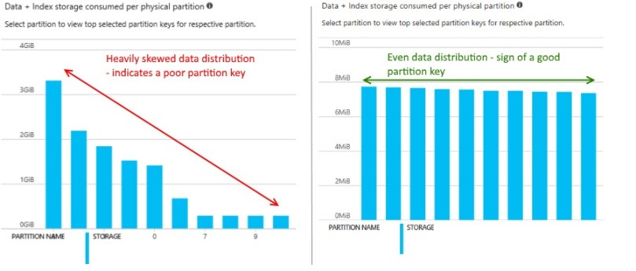

# Mongo Modeling and Partitioning in CosmosDB

## Links

- [Azure Cosmos DB's API for MongoDB](https://docs.microsoft.com/en-us/azure/cosmos-db/mongodb-introduction)
- [Cosmos/Mongo 4.0 Feature Support](https://docs.microsoft.com/en-us/azure/cosmos-db/mongodb-feature-support-40)
- [Partitioning Overview](https://docs.microsoft.com/en-us/azure/cosmos-db/partitioning-overview)
- [Cosmos/Mongo Indexing](https://docs.microsoft.com/en-us/azure/cosmos-db/mongodb-indexing)
- [Under the Hood; Replica Sets](https://docs.microsoft.com/en-us/azure/cosmos-db/global-dist-under-the-hood)

## Terminology

- A **container** in CosmosDB is synonymous with a Mongo **collection**

## Partitioning in CosmosDB

- You define the **Partitition Key Attribute** for each container
  - This attribute name **can not be changed** after the container has been created
  - Each document in the container needs to have a value for this attribute
  - Examples: customerNumber, orderID, deviceID
  - Best Practice:
    - Use **pk** and populate it with an appropriate value
    - Gives you the ability to modify your partition key scheme over time
    - For example: customerNumber -> customerNumber:year -> customerNumber:year:month

- **20GB max** per **Logical Partition** or for a **Partion Key Value** - (You manage/choose this)
- **50GB max** per **Physical Partition** - (CosmosDB automatically manages these)

- CosmosDB uses a **Hashing Algorithm** to assign documents to physical partitons
  - determines the physical partition for a given logical partition key value

- Each physical partition is implemented as a **Replica Set**
  - Four nodes; four copies of your data
  - Roles: Leader, Follower, Forwarder
  - This is all managed for you by the CosmosDB PaaS service

<p align="center"></p>

---

Global Replication via the **Forwarder** node:

<p align="center"></p>

---

<p align="center"></p>

- The design on the left is skewed ( countryCode as partition key? ).  Hot and underused partitions.
- The design on the right is perfect.

<p align="center"></p>

---

## Request Units (RU)

- [Request Units](https://docs.microsoft.com/en-us/azure/cosmos-db/request-units)
- [Request Unit considerations](https://docs.microsoft.com/en-us/azure/cosmos-db/request-units#request-unit-considerations)
- [x-ms-request-charge](https://docs.microsoft.com/en-us/rest/api/cosmos-db/common-cosmosdb-rest-response-headers)

---

## Design

- **Query Driven Design**
  - Focus on the queries, not the shape of your documents

- **Choose the right Partition Key**
  - Use a High Cardinality value
  - Use a Well Distributed value
  - Use a Value you often Query on
  - The name of the partition key attribute can't change
  - I use the generic attribute **/pk**, for evolution of the actual value
  - 20GB max per logical partition key

- **Scaling**
  - Infinitely wide via Logical and Physical Partitioning
  - CosmosDB manages/creates Physical partitions as necessary, and reallocates the data
  - Two Pricing/Scaling Models:
    - **Manual** - 400 min at the container level
      - Scale up and down at a factor of 10
      - Use SDK, PowerShell, az CLI, REST, or Azure Portal to change the RU throughput 
    - **Autoscale** - 4000 min at the database level
      - Max of 25 containers/collections per database
      - Scale up and down at a factor of 10.  4000 -> 400
      - Use SDK, PowerShell, az CLI, REST, or Azure Portal to change the max RU throughput 
      - Costs 50% more per RU vs Manual, but usually well worth it

- **Containers/Collections**
  - Have 25 or less containers per database to enable **RU autoscale**
  - Store disimilar but related documents in the same container
    - use a **doctype** attribute to distinguish them
  - 400 RU min per container with Manual Scaling
  - Customer example:
    - 1400 containers @ 400 Manual RU vs 20 containers @ Autoscale
    - 560,000 vs 50,000 RU

- **Document Size**
  - 2MB max doc size
  - Prefer smaller documents
  - Bounded vs Unbounded Arrays
    - Consider refactoring embedded arrays into separate documents

- **Point Reads and Queries**
  - **Point-Reads** are the most efficient and lowest cost
    - These read One Document by id and partition key
  - Query by partition key as much as possible
  - Use **Partition Key Joins** to aggregate related documents efficiently
- Know the costs of your queries during development; x-ms-request-charge
- Autoscaled databases - 

### Example - eCommerce Order, Line Items, Deliveries

```
{
  "pk": "XK1123",
  "doctype": "order",
  "orderNumber": "XK1123",
  ... order attributes ...
}

{
  "pk": "XK1123",
  "doctype": "lineitem",
  "orderNumber": "XK1123",
  "lineItem": 1,
  ... lineitem attributes ...
}

{
  "pk": "XK1123",
  "doctype": "lineitem",
  "orderNumber": "XK1123",
  "lineItem": 2,
  ... lineitem attributes ...
}

{
  "pk": "XK1123",
  "doctype": "delivery",
  "orderNumber": "XK1123",
  "lineItem": 1,
  "deliveryNumber": 1,
  ... delivery attributes ...
}

select * from c where c.pk = "XK1123"
select * from c where c.pk = "XK1123" and c.doctype = "order"
select * from c where c.pk = "XK1123" and c.doctype in ("order", "lineitem")
```
