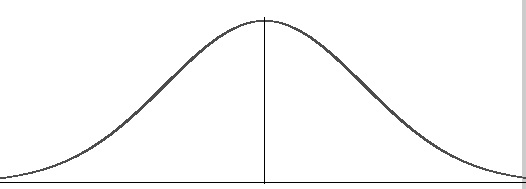

## Agenda - 3/17/2022

### 1. Intro to CosmosDB
### 2. CosmosDB SQL API 
### 3. CosmosDB Mongo API
### 4. MongoDB to CosmosDB Migrations
### 5. Synapse Link

This URL: https://github.com/cjoakim/azure-cosmosdb/blob/main/presentations/adhoc/pp.md 

```

Chris Joakim
Azure CosmosDB Global Black Belt
chjoakim@microsoft.com

```

---

## Intro to CosmosDB

### Wait, what exactly is "NoSQL"?

<p align="center"></p>

Answer: Datastores and Databases that are **not relational**.

---

### CosmosDB = a Multi-Modal NoSQL Database with multiple APIs

<p align="center"></p>

- **Born in the Cloud**; it was never an on-prem database
- **High Performance**
  - Capable of millions of TPS
  - Guranteed performance, see P99 bell curve below
- **High Availability**
  - 99.99% guranteed uptime for single region
  - 99.999% guranteed uptime for multi region
- **Infinite Horizontal Scalability**
  - PBs of data
  - 50GB Physical Partitions
- The above features are **in it's DNA**
- But suitable for small worloads, too

#### Foundation and APIs

- **Common Database Foundation** with multiple APIs
- Select **One** API per CosmosDB account
- **APIs**
  - Document Oriented
    - **SQL/Core, Mongo**
  - Column Oriented
    - **Cassandra**
  - Graph
    - **Gremlin**
  - Row Oriented 
    - **Table**

- Some APIs are open-source, some are Microsoft proprietary
- Our Mongo API is built upon the (incredible) CosmosDB foundation, not MongoDB (i.e. - Community Edition)
- CosmosDB conforms to the **over the wire protocols of the open-source APIs**

#### P99 10ms Reads / 15ms Writes

<p align="center"></p>

- https://azure.microsoft.com/en-us/blog/azure-documentdb-service-level-agreements/
  > "we will refund you up to 25% of your monthly bill."

---

### Global Replication

<p align="center"></p>

Also: **Availability Zones** within a Region

---

### Request Units

- https://docs.microsoft.com/en-us/azure/cosmos-db/request-units

> The cost to do a **point read** (i.e. fetching a single item by its ID and partition key value)
> for a 1 KB document is 1 Request Unit (1.0 RU)
> Approx 5 RU for a 1 KB write

- Think of it as a **per second budget of throughput**
  - For example, what can you do with 400 RU?
    - 400 1K point reads

- This is the **primary cost component of CosmosDB**; throughput or RUs
  - Throughput cost model, not a licensing model

---

### Scaling

- Manual Scale
- Auto Scale
- Database Level Shared Throughput
- Also a "Serverless" version

---

### Partitions/Sharding

<p align="center"></p>

- 50GB Physical Partitions
  - Managed/created by CosmosDB
  - Automatic Sharding

- 20GB Logical Partition Limit - per your **partition key attribute"

- Strive to specify the partition key attribute in your queries for best performance and costs

---

### Change Feed

<p align="center"></p>

- https://docs.microsoft.com/en-us/azure/cosmos-db/change-feed

---

### Log Analytics

<p align="center"></p>

- [Monitor CosmosDB](https://docs.microsoft.com/en-us/azure/cosmos-db/monitor-cosmos-db)
- [Examples](https://docs.microsoft.com/en-us/azure/azure-monitor/logs/examples)
- [Basic Queries](https://docs.microsoft.com/en-us/azure/cosmos-db/cosmosdb-monitor-logs-basic-queries)
- [Kusto Query Language quick reference](https://docs.microsoft.com/en-us/azure/data-explorer/kql-quick-reference)
- [Resource Specific Logging (CDB)](https://docs.microsoft.com/en-us/azure/cosmos-db/cosmosdb-monitor-logs-basic-queries#resource-specific-queries)

---

### Restores

Not often used or needed, especially with a Multi-Region account.

#### Original Periodic Backups

- https://docs.microsoft.com/en-us/azure/cosmos-db/configure-periodic-backup-restore

#### Point-In-Time-Restore (PITR)

- https://docs.microsoft.com/en-us/azure/cosmos-db/continuous-backup-restore-introduction

---

### Synapse Link and HTAP

- Hybrid Transactional and Analytical Processing (HTAP)
- https://docs.microsoft.com/en-us/azure/cosmos-db/synapse-link
- https://github.com/cjoakim/azure-cosmosdb-synapse-link

<p align="center"></p>

---

## Structure of a CosmosDB SQL or Mongo API Account

```
  - Account
    - Database(s)
      - Collection(s)
        - Documents
```
--- 

## CosmosDB SQL API 

- Our most popular CosmosDB API
- Also known as the **Core** API?
- Why is it called SQL API if it's NoSQL?

- **JSON Documents** - very similar to MongoDB
  - the _ underscored attributes are system generated (ex. - **_etag**)
  - Can be deeply nested JSON structures

```
{
    "customer_id": 199,
    "first_name": "Veronica",
    "last_name": "Gilbert",
    "full_name": "Veronica Gilbert",
    "address": "6292 Cervantes Port",
    "city": "West Joseph",
    "state": "IA",
    "doc_epoch": 1644166252599,
    "doc_time": "2022/02/06-16:50:52",
    "id": "2503a58f-0902-4344-8874-7fbe5d2073fb",
    "pk": 199,
    "_rid": "OpdUAKTYP9kDAAAAAAAAAA==",
    "_self": "dbs/OpdUAA==/colls/OpdUAKTYP9k=/docs/OpdUAKTYP9kDAAAAAAAAAA==/",
    "_etag": "\"940514bd-0000-0100-0000-61fffc6d0000\"",
    "_attachments": "attachments/",
    "_ts": 1644166253
}
```

- **"CosmosDB-Aware" Native SDKs** - DotNet, Java, Python, Node.js 
  - Great features
  - Auto Homing
  - Preferred Regions
  - Auto Configurable Retries
  - Integrated CosmosDB Metrics - RUs, etc 
  - DevOps functionality - Administer Databases, Containers, Throughput

- **Indexing**
  - Default policy is to index everything
  - You can specify Indexing with JSON
  - Index single attributes
  - Or multiple attributes with **Composite Indexes**
    - Applies to SELECT and ORDER BY clauses
    - https://devblogs.microsoft.com/cosmosdb/new-ways-to-use-composite-indexes/

  - A Sprint Through CosmosDB Presentation, covers indexing
    - https://github.com/cjoakim/azure-cosmos-demo22

- **GeoJSON**
  - https://docs.microsoft.com/en-us/azure/cosmos-db/sql/sql-query-geospatial-intro

- **Optimistic Concurrency Control (OCC)**
  - https://docs.microsoft.com/en-us/azure/cosmos-db/sql/database-transactions-optimistic-concurrency#optimistic-concurrency-control

---

## CosmosDB Mongo API

- **"It's just Mongo, it just works as you expect"**
- **Use the same Tooling** - mongoexport, mongoimport, 3T, etc 
- **Use the same SDKs** - java driver, pymongo, etc
- **Use the same Indexing** - partition key is implicitly indexed

- **Design Considerations**
  - Smaller documents
  - Consider the RU costs of updating large documents
  - Consider documents in the same partition key rather than embedding
  - It's schemaless - containers aren't relational tables

---

## MongoDB to CosmosDB Migrations

- **Mongo to Cosmos migrations**
  - **Data Migration Assistant** (DMA)
  - **Data Migration Service** (DMS) 
  - **Azure Data Factory** (ADF) 
  - **Code-based migration process**
    - Source database metadata
    - User-specified mappings
    - Multi-modal Code generation
    - https://github.com/Azure-Samples/azure-cosmos-db-mongo-migration

---

## Synapse Link Demonstration

- Hybrid Transactional and Analytical Processing (HTAP)
- https://docs.microsoft.com/en-us/azure/cosmos-db/synapse-link
- https://github.com/cjoakim/azure-cosmosdb-synapse-link
- Java Client
- Spark Notebook - PySpark and Scala
- Aggregate Sales by Customer and Write to Azure PostgreSQL

<p align="center"></p>
