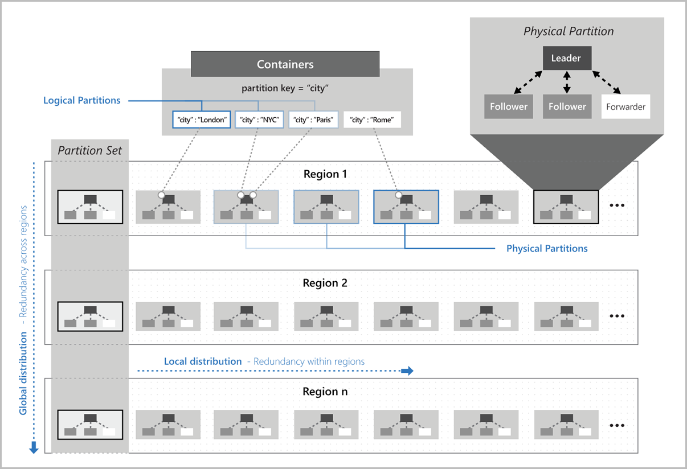
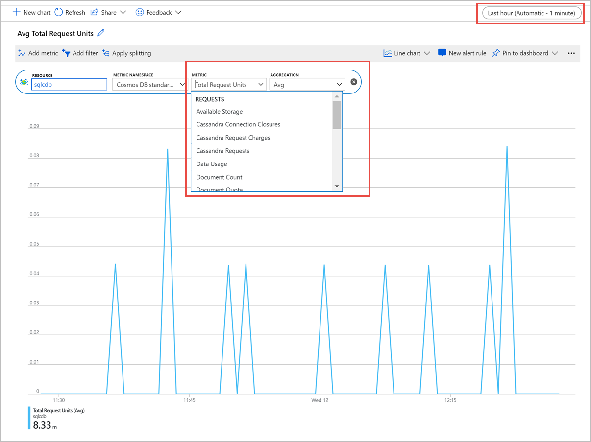

# Agenda - 3/17/2022

### Intro to CosmosDB
### CosmosDB SQL API 
### CosmosDB Mongo API
### MongoDB to CosmosDB Migrations
### Synapse Link


```
Chris Joakim
Azure CosmosDB Global Black Belt
chjoakim@microsoft.com
```

---


## Intro to CosmosDB

### Multi-Modal - SQL/Core, Mongo, Cassandra, Gremlin, and Table APIs

<p align="center"></p>

---

### Global Replication

<p align="center"></p>

---

### Request Units and Scaling 

- https://docs.microsoft.com/en-us/azure/cosmos-db/request-units

---

### Partitions/Sharding

<p align="center"></p>

---

### Change Feed

<p align="center"></p>

- https://docs.microsoft.com/en-us/azure/cosmos-db/change-feed

---

### Log Analytics

<p align="center"></p>

- [Monitor CosmosDB](https://docs.microsoft.com/en-us/azure/cosmos-db/monitor-cosmos-db)
- [Examples](https://docs.microsoft.com/en-us/azure/azure-monitor/logs/examples)
- [Basic Queries](https://docs.microsoft.com/en-us/azure/cosmos-db/cosmosdb-monitor-logs-basic-queries)
- [Kusto Query Language quick reference](https://docs.microsoft.com/en-us/azure/data-explorer/kql-quick-reference)
- [Resource Specific Logging (CDB)](https://docs.microsoft.com/en-us/azure/cosmos-db/cosmosdb-monitor-logs-basic-queries#resource-specific-queries)

---

### Restores

Not often used or needed, especially with a Multi-Region account.

#### Original Periodic Backups

- https://docs.microsoft.com/en-us/azure/cosmos-db/configure-periodic-backup-restore

#### Point-In-Time-Restore (PITR)

- https://docs.microsoft.com/en-us/azure/cosmos-db/continuous-backup-restore-introduction


---

### Synapse Link and HTAP

- Hybrid Transactional and Analytical Processing (HTAP)
- https://docs.microsoft.com/en-us/azure/cosmos-db/synapse-link
- https://github.com/cjoakim/azure-cosmosdb-synapse-link

<p align="center"></p>

---

## CosmosDB SQL API 

- JSON Document Oriented
- Our most popular CosmosDB API
- Native SDKs - DotNet, Java, Python, Node.js 
  - Great features
  - Auto Homing
  - Preferred Regions
  - Auto Configurable Retries
  - Integrated CosmosDB Metrics - RUs, etc 
- 

Sample Document, the _ underscored attributes are system generated.

```
{
    "customer_id": 199,
    "first_name": "Veronica",
    "last_name": "Gilbert",
    "full_name": "Veronica Gilbert",
    "address": "6292 Cervantes Port",
    "city": "West Joseph",
    "state": "IA",
    "doc_epoch": 1644166252599,
    "doc_time": "2022/02/06-16:50:52",
    "id": "2503a58f-0902-4344-8874-7fbe5d2073fb",
    "pk": 199,
    "_rid": "OpdUAKTYP9kDAAAAAAAAAA==",
    "_self": "dbs/OpdUAA==/colls/OpdUAKTYP9k=/docs/OpdUAKTYP9kDAAAAAAAAAA==/",
    "_etag": "\"940514bd-0000-0100-0000-61fffc6d0000\"",
    "_attachments": "attachments/",
    "_ts": 1644166253
}
```

---

## CosmosDB Mongo API


- Tooling and SDKs - mongoexport, mongoimport, 3T, etc 
- Mongo to Cosmos migrations
  - **Data Migration Assistant** (DMA)
  - **Data Migration Service** (DMS) 
  - **Azure Data Factory** (ADF) 
  - **Code-based migration process**
    - Source database metadata
    - User-specified mappings
    - Multi-modal Code generation
    - https://github.com/Azure-Samples/azure-cosmos-db-mongo-migration
- Design Considerations

---

## MongoDB to CosmosDB Migrations

---

## Synapse Link


---
---

## MongoDB to CosmosDB Migrations


## TODO - update this presentation below 

### This Presentation URL

https://github.com/cjoakim/azure-cosmosdb/blob/main/presentations/adhoc/pp.md

---

## CosmosDB

- NoSQL database PaaS service
- A single CosmosDB account can be one of: Core SQL, Mongo, Cassandra, Gremlin, etc. APIs
- Very fast reads and writes, point reads especially, performance SLA
- High Availability.  99.99 or 99.999%
- Single Azure Region or Multi-Region with Global Replication
- Scalable Throughput with Request Units (RU).  Autoscale or Manual
- Easy integration with the rest of the Azure Ecosystem

---

## CosmosDB/SQL API Vs CosmosDB/Mongo API Vs CosmosDB/Cassandra API

- https://azure.microsoft.com/en-us/services/cosmos-db

- [Choose an API](https://docs.microsoft.com/en-us/azure/cosmos-db/choose-api)
  - [Core/SQL API](https://docs.microsoft.com/en-us/azure/cosmos-db/choose-api#coresql-api)
    - **Document-oriented, schemaless**
    - Recommended for **Greenfield** apps
    - Use the excellent **Microsoft SDKs for CosmosDB** - DotNet, Java, Python, Node.js, etc
    - Best **integration** into the rest of the Azure Platform, such as:
      - **Azure Synapse Link** for Analytics.  HTAP
        - https://github.com/cjoakim/azure-cosmosdb-synapse-link
        - [Azure Synapse Analytics](https://azure.microsoft.com/en-us/services/synapse-analytics/)
      - Azure Functions and the CosmosDB Change Feed
        - https://github.com/cjoakim/azure-cosmosdb-changefeed
      - Azure Stream Analytics
        - IoT workloads with IotHub or EventHubs
      - Azure Cognitive Search
        - https://github.com/cjoakim/azure-cognitive-search-example
      - Azure Monitor (Log Analytics)

  - [MongoDB API](https://docs.microsoft.com/en-us/azure/cosmos-db/choose-api#api-for-mongodb)
    - **Document-oriented, schemaless**
    - Typically for **lift-and-shift** apps
    - Use the **open-source driver SDKs** (pymongo, etc)
    - Use **mongo tooling** like mongoexport, mongoimport, Studio 3T, and even MatLab

  - [Cassandra API](https://docs.microsoft.com/en-us/azure/cosmos-db/choose-api#cassandra-api)
    - **Column-oriented** schema
    - Cassandra Query Language (CQL), and tools like CQL shell
    - Use the **open-source driver SDKs**

  - [Azure Managed Instance for Apache Cassandra](https://docs.microsoft.com/en-us/azure/managed-instance-apache-cassandra/introduction)
    - Not CosmosDB
    - Deployed automatically as **Virtual Machine scale sets**, in Azure Virtual Networks
    - Enables **Hybrid deployments** - on-prem and Azure

- [Onboarding Best Practices](https://azure.microsoft.com/en-us/resources/azure-cosmos-db-onboarding-best-practices/)

---

## How CosmosDB Mongo API compares to MongoDB Atlas

- Integration with the rest of the Azure Ecosystem
- No tiers.  Highly granular 100-RU increments
- CosmosDB currently supports 4.0 and most of the 4.0 API
- https://docs.microsoft.com/en-us/azure/cosmos-db/mongodb/feature-support-40 

---

## Price comparison between the APIs

- [Pricing](https://azure.microsoft.com/en-us/pricing/details/cosmos-db/)
- [Price/Capacity Calculator](https://cosmos.azure.com/capacitycalculator/)
- [Autoscale](https://docs.microsoft.com/en-us/azure/cosmos-db/provision-throughput-autoscale)

---

## Advice on best practices on: performance, HA/DR, RTO/RPO, etc

- [High Availability](https://docs.microsoft.com/en-us/azure/cosmos-db/high-availability)

>>> To ensure high availability at all times it's recommended to set up your Azure CosmosDB
>>> account with a single write region and at least a second (read) region and enable Service-Managed failover.

- [Continuous Backup Mode - SQL and Mongo](https://docs.microsoft.com/en-us/azure/cosmos-db/restore-account-continuous-backup)
- [Periodic Backup](https://docs.microsoft.com/en-us/azure/cosmos-db/configure-periodic-backup-restore)

